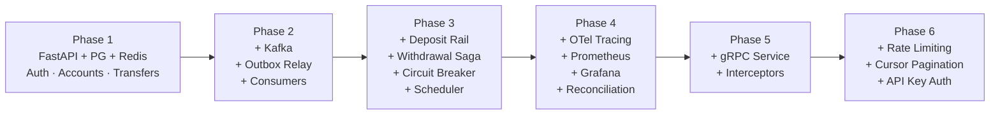

# MiniBank — Product Documentation Index

## Project Overview

MiniBank is a simplified digital banking backend built to learn fintech engineering patterns: double-entry ledger, event-driven architecture, distributed system design patterns, observability, and API design.

**Stack:** Python 3.12 + FastAPI · PostgreSQL · Kafka · Redis · OpenTelemetry · gRPC

---

## Document Status

| Phase | Scope | PRD | System Design | Build Status |
|-------|-------|-----|---------------|--------------|
| [Phase 1 — Foundation](#phase-1--foundation) | Auth, single account, ledger, P2P transfer, idempotency | [PRD](phase-1-foundation/PRD.md) | [System Design](phase-1-foundation/SYSTEM-DESIGN.md) | `not started` |
| [Phase 2 — Event-Driven](#phase-2--event-driven-architecture) | Kafka, outbox, consumers, CQRS, DLT | [PRD](phase-2-events/PRD.md) | [System Design](phase-2-events/SYSTEM-DESIGN.md) | `not started` |
| [Phase 3 — Advanced Payments](#phase-3--advanced-payments) | Deposits, withdrawal saga, circuit breaker, scheduled payments | [PRD](phase-3-payments/PRD.md) | [System Design](phase-3-payments/SYSTEM-DESIGN.md) | `not started` |
| [Phase 4 — Observability](#phase-4--observability--reconciliation) | Tracing, metrics, dashboards, reconciliation | [PRD](phase-4-observability/PRD.md) | [System Design](phase-4-observability/SYSTEM-DESIGN.md) | `not started` |
| [Phase 5 — gRPC](#phase-5--grpc--service-extraction) | Notification service extraction, inter-service comms | [PRD](phase-5-grpc/PRD.md) | [System Design](phase-5-grpc/SYSTEM-DESIGN.md) | `not started` |
| [Phase 6 — API Hardening](#phase-6--api-hardening) | Rate limiting, cursor pagination, throttling, API key auth | [PRD](phase-6-api-hardening/PRD.md) | [System Design](phase-6-api-hardening/SYSTEM-DESIGN.md) | `not started` |

---

## Phase 1 — Foundation
**Weeks 1–5 · ~3–4 hrs/week**

Core banking primitives: user auth, single account per user, double-entry ledger with system account, P2P transfers with row-level locking, idempotency, and concurrency safety.

**Deliverables:** Atomic P2P transfers passing a 10-parallel-transfer concurrency test. Ledger always sums to zero. Idempotency prevents duplicate debits.

---

## Phase 2 — Event-Driven Architecture
**Weeks 6–9 · ~3–4 hrs/week**

Introduce Kafka. Week 6: publish directly (experience event loss). Week 7: retrofit the outbox pattern (fix it). Week 8: build consumers — audit log, notifications, CQRS activity view. Week 9: dead-letter topics and reliability.

**Deliverables:** No event loss on Kafka restart. Audit log populated purely from events. CQRS read model serving activity feed.

---

## Phase 3 — Advanced Payments
**Weeks 10–13 · ~3–4 hrs/week**

Deposits (simulated inbound rail), withdrawals with orchestration saga + crash recovery, circuit breaker, scheduled recurring payments with `FOR UPDATE SKIP LOCKED`.

**Deliverables:** Withdrawal saga compensates correctly on rail failure and recovers after process crash. Circuit breaker fast-fails and auto-recovers.

---

## Phase 4 — Observability & Reconciliation
**Weeks 14–16 · ~3–4 hrs/week**

Structured logging (structlog), distributed tracing (OpenTelemetry → Jaeger), Prometheus metrics, Grafana dashboards, and a reconciliation job that verifies the double-entry invariant.

**Deliverables:** Full request trace visible in Jaeger end-to-end. Grafana dashboards live. Reconciliation catches corrupted balances.

---

## Phase 5 — gRPC & Service Extraction
**Week 17 · ~3–4 hrs**

Extract notification service as a standalone gRPC process. Add auth, logging, and tracing interceptors. Final dockerization and README.

**Deliverables:** `docker compose up` runs everything. gRPC notification service with interceptors. Architecture README.

---

## Phase 6 — API Hardening
**Weeks 18–19 · ~3–4 hrs/week**

Rate limiting (Redis token bucket), cursor-based pagination, per-endpoint throttling, API key management for service-to-service auth.

**Deliverables:** Rate limiting enforced. Cursor pagination stable under concurrent inserts. Internal endpoints protected by API key.

---

## Architecture Evolution

---

## Skills × Phases

| Skill | Phase |
|-------|-------|
| Double-entry ledger, system account, balance derivation | 1 |
| `SELECT ... FOR UPDATE`, row-level locking, idempotency | 1 |
| REST API design, OpenAPI contract-first, Pydantic v2 | 1 |
| Kafka, domain events, outbox pattern, CQRS | 2 |
| Idempotent consumers, dead-letter topics, offset management | 2 |
| Deposit simulation (push model), deposit idempotency | 3 |
| Saga pattern (orchestration), saga recovery, `FOR UPDATE SKIP LOCKED` | 3 |
| Circuit breaker (3-state), scheduled job execution | 3 |
| OpenTelemetry, Prometheus, Grafana, structlog | 4 |
| Reconciliation, double-entry invariant verification | 4 |
| gRPC, protobuf, buf CLI, gRPC interceptors | 5 |
| Rate limiting (token bucket), cursor pagination, API key auth | 6 |
