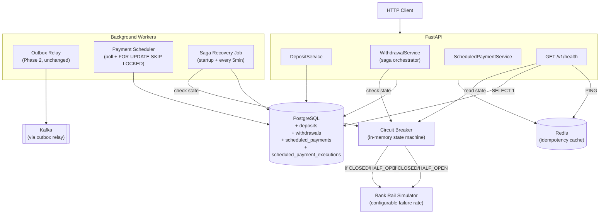

# System Design — Phase 3: Advanced Payments

**Phase:** 3 of 6
**Status:** `not started`

---

## Implementation Schedule (Weeks 10–13)

Five user stories distributed across four weeks. Each week builds on the previous — the ordering reflects dependency chains, not arbitrary grouping.

| Week | Story | Key Code Artifacts | Migrations | Tests |
|------|-------|--------------------|------------|-------|
| **10** | US-3.1 (Deposit) | `app/models/deposit.py` · `app/schemas/deposit.py` · `app/services/deposit_service.py` · `app/routers/deposits.py` · `app/routers/dev.py` (extend) | **0007** (deposits) | `test_deposits.py`: idempotency on duplicate `external_reference`, rejection paths, ledger invariant |
| **11** | US-3.2 (Withdrawal saga) | `app/models/withdrawal.py` · `app/schemas/withdrawal.py` · `app/services/withdrawal_service.py` (saga orchestrator) · `app/routers/withdrawals.py` · `rail/simulator.py` | **0008** (withdrawals) | `test_withdrawals.py`: happy path, rail failure → compensation, idempotency via `Idempotency-Key` header |
| **12** | US-3.3 (Saga recovery) + US-3.4 (Circuit breaker) | `app/circuit_breaker.py` · `app/dependencies.py` (`get_circuit_breaker`, `get_rail`) · `app/routers/health.py` · `workers/saga_recovery.py` · `app/main.py` lifespan (startup recovery + background loops) | — | `test_circuit_breaker.py`: state transitions · `test_saga_recovery.py`: crash-at-pending, crash-at-submitted, idempotent compensation |
| **13** | US-3.5 (Scheduled payments) | `app/models/scheduled_payment.py` · `app/models/scheduled_payment_execution.py` · `app/schemas/scheduled_payment.py` · `app/services/scheduled_payment_service.py` · `app/routers/scheduled_payments.py` · `workers/payment_scheduler.py` · activity consumer extension | **0009** (scheduled_payments + executions) | `test_scheduled_payments.py`: due-time execution, insufficient balance skip, concurrent scheduler safety · phase-level invariant test (sum=0 across all flows) |

### Dependency graph

```
Week 10: Deposit ──┐
                   │
Week 11: Withdrawal saga ──┬──► Week 12: Recovery + Circuit breaker
                           │              │
                           │              ▼
                           └──► Week 13: Scheduled payments
                                         (reuses transfer() — independent of 12)
```

- **Week 10** is independent of everything else; can slip without blocking downstream work
- **Week 12 depends on Week 11** — the recovery job operates on `withdrawals` rows
- **Week 13 is independent of Week 12** — if Week 12 slips, Week 13 can still start (scheduler reuses `transfer()`, not withdrawals)

### Weekly time estimates (at 3–4 hrs/week)

| Week | Estimated Effort | Buffer Risk |
|------|------------------|-------------|
| 10 | 3 hrs | Low — single-TX flow, no saga |
| 11 | 4+ hrs | **High** — saga spans 3 TXs + rail I/O + idempotency. May spill into Week 12. |
| 12 | 4 hrs | Medium — two workers + circuit breaker, but patterns established |
| 13 | 3 hrs | Low — reuses `transfer()`, scheduler is orchestration only |

**Slip plan:** If Week 11 spills, compress Week 12 by deferring health endpoint polish (keep functional, skip production-grade DB/Redis ping timeouts) and land US-3.5 in a stretched Week 13.

---

## 1. Architecture Overview

Phase 3 adds bank rail simulation, withdrawal saga, circuit breaker, and scheduled payment runner on top of the Phase 1–2 foundation.



### Interaction with Phase 1–2 components

| Phase 1–2 component | How Phase 3 uses it |
|---------------------|---------------------|
| `LedgerEntry` model | Deposit/withdrawal/compensation entries follow same two-leg pattern |
| `get_balance()` | Withdrawal checks balance before debit |
| `transfer()` service | Scheduled payments call this directly |
| `publish_event()` | All Phase 3 events go through outbox (same function) |
| Outbox relay worker | Delivers Phase 3 events to Kafka (no changes needed — relay reads `topic` column from outbox rows, no hardcoded topic list) |
| `SYSTEM_ACCOUNT_ID` | Counter-party for deposit credits and withdrawal debits |

---

## 2. Database Migrations

### Migration 0006: Add reference_id to ledger_entries (pre-Phase 3 prerequisite) (Already applied)

The existing `LedgerEntry` model lacks a `reference_id` column needed to link ledger entries back to their source entity (deposit, withdrawal, transfer). Phase 1 used `transaction_id` to group the two legs but has no column pointing back to the source table.

**This migration must be applied before any Phase 3 code.** See `PRE-PHASE-3-FIXES.md` for full context.

```sql
-- alembic/versions/0006_add_ledger_reference_id.py
ALTER TABLE ledger_entries
    ADD COLUMN reference_id UUID;
    -- Points to the source entity: deposits.id, withdrawals.id, transfers.id
    -- Not a FK (polymorphic reference). entry_type disambiguates which table.
    -- NULL for existing Phase 1–2 entries (backward compatible).

CREATE INDEX idx_ledger_entries_reference_id ON ledger_entries (reference_id)
    WHERE reference_id IS NOT NULL;
```

### Migration 0007: Add deposits table

```sql
-- alembic/versions/0007_add_deposits.py
CREATE TABLE deposits (
    id                  UUID          PRIMARY KEY DEFAULT gen_random_uuid(),
    account_id          UUID          NOT NULL REFERENCES accounts(id),
    amount              NUMERIC(19,4) NOT NULL CHECK (amount > 0),
    currency            VARCHAR(3)    NOT NULL DEFAULT 'USD',
    status              VARCHAR(20)   NOT NULL DEFAULT 'pending',
                        -- pending → completed | rejected
    source_type         VARCHAR(30)   NOT NULL,
                        -- bank_transfer | card_topup | direct_debit
    external_reference  VARCHAR(255)  NOT NULL UNIQUE,
                        -- Rail's transaction ID. UNIQUE = idempotency guarantee.
                        -- Second webhook with same ref → UniqueViolation → return 200.
    rejection_reason    VARCHAR(100),
                        -- NULL unless status='rejected'. Human-readable.
    created_at          TIMESTAMPTZ   NOT NULL DEFAULT NOW(),
    completed_at        TIMESTAMPTZ,
                        -- When ledger entry was written (NULL until completed)
    updated_at          TIMESTAMPTZ   NOT NULL DEFAULT NOW()
);

-- For user's deposit list query (GET /v1/deposits, future)
CREATE INDEX idx_deposits_account_id ON deposits (account_id, created_at DESC);
```

### Migration 0008: Add withdrawals table

```sql
-- alembic/versions/0008_add_withdrawals.py
CREATE TABLE withdrawals (
    id                   UUID          PRIMARY KEY DEFAULT gen_random_uuid(),
    account_id           UUID          NOT NULL REFERENCES accounts(id),
    amount               NUMERIC(19,4) NOT NULL CHECK (amount > 0),
    currency             VARCHAR(3)    NOT NULL DEFAULT 'USD',
    status               VARCHAR(20)   NOT NULL DEFAULT 'pending',
                         -- pending → submitted → completed | failed
    failure_code         VARCHAR(50),
                         -- NULL unless status='failed'. Values:
                         -- INVALID_ACCOUNT | BENEFICIARY_CLOSED | TIMEOUT |
                         -- NETWORK_ERROR | CIRCUIT_OPEN
    destination_type     VARCHAR(30)   NOT NULL,
                         -- bank_transfer | card_withdrawal
    destination_details  JSONB         NOT NULL DEFAULT '{}',
                         -- { "sort_code": "...", "account_number": "..." }
                         -- or { "iban": "..." }
    external_reference   VARCHAR(255),
                         -- Rail's transaction ID. NULL until submitted.
                         -- Filled when rail API returns its reference.
    idempotency_key      VARCHAR(255)  UNIQUE NOT NULL,
                         -- Client-provided via Idempotency-Key header.
    created_at           TIMESTAMPTZ   NOT NULL DEFAULT NOW(),
    submitted_at         TIMESTAMPTZ,
    completed_at         TIMESTAMPTZ,
    updated_at           TIMESTAMPTZ   NOT NULL DEFAULT NOW()
);

-- Partial index for recovery job: find stuck rows without full table scan
CREATE INDEX idx_withdrawals_recovery
    ON withdrawals (updated_at)
    WHERE status IN ('pending', 'submitted');

-- For user's withdrawal list query
CREATE INDEX idx_withdrawals_account_id ON withdrawals (account_id, created_at DESC);
```

### Migration 0009: Add scheduled_payments and scheduled_payment_executions tables

```sql
-- alembic/versions/0009_add_scheduled_payments.py
CREATE TABLE scheduled_payments (
    id              UUID          PRIMARY KEY DEFAULT gen_random_uuid(),
    from_account_id UUID          NOT NULL REFERENCES accounts(id),
    to_account_id   UUID          NOT NULL REFERENCES accounts(id),
    amount          NUMERIC(19,4) NOT NULL CHECK (amount > 0),
    currency        VARCHAR(3)    NOT NULL DEFAULT 'USD',
    frequency       VARCHAR(20)   NOT NULL CHECK (frequency IN ('daily', 'weekly', 'monthly')),
    next_run_at     TIMESTAMPTZ   NOT NULL,
    status          VARCHAR(20)   NOT NULL DEFAULT 'active',
                    -- active | cancelled
    created_at      TIMESTAMPTZ   NOT NULL DEFAULT NOW(),
    updated_at      TIMESTAMPTZ   NOT NULL DEFAULT NOW()
);

-- Scheduler query: find due active payments
CREATE INDEX idx_scheduled_payments_due
    ON scheduled_payments (next_run_at)
    WHERE status = 'active';

-- Execution log: one row per attempted execution
CREATE TABLE scheduled_payment_executions (
    id                    UUID          PRIMARY KEY DEFAULT gen_random_uuid(),
    scheduled_payment_id  UUID          NOT NULL REFERENCES scheduled_payments(id),
    scheduled_for         TIMESTAMPTZ   NOT NULL,
                          -- The next_run_at value that triggered this execution
    result                VARCHAR(20)   NOT NULL,
                          -- executed | skipped
    skip_reason           VARCHAR(100),
                          -- NULL if executed. e.g. "INSUFFICIENT_BALANCE", "ACCOUNT_INACTIVE"
    transfer_id           UUID,
                          -- References transfers.id if result='executed'. NULL if skipped.
    executed_at           TIMESTAMPTZ   NOT NULL DEFAULT NOW()
);

CREATE INDEX idx_spe_payment_id ON scheduled_payment_executions (scheduled_payment_id, executed_at DESC);
```


---

## 3. Deposit Flow (Push Model)

### Real-world context

In production:
- The banking partner sends a webhook: "Inbound payment received: $100, reference BANK-TXN-001"
- Your system matches the payment to a user account (by virtual IBAN, reference, or account number)
- Validation runs: AML screening, limits check, account status check
- Only after validation passes does money enter the ledger

### Sequence

The entire deposit flow runs inside a single DB transaction. There is no multi-step saga — deposits are simple because money flows inward (we control the ledger write; no external call can fail mid-operation).

```
POST /v1/dev/simulate-deposit
  { "account_id": "...", "amount": "100.00", "currency": "USD",
    "source_type": "bank_transfer", "external_reference": "BANK-TXN-001" }
        │
        ▼ Check: APP_ENV == "development" (403 otherwise)
        │
        ▼ BEGIN TX (single transaction covers everything below):
        │
        ▼ Try INSERT deposits (status='pending', external_reference, ...)
        │   flush() — raises IntegrityError on UniqueViolation
        │   UniqueViolation? → ROLLBACK, fresh SELECT by external_reference, return 200
        │
        ▼ Validate:
        │   - account exists? (SELECT accounts WHERE id = account_id)
        │   - account.status == 'active'?
        │   - amount > 0?
        │   - currency supported? (just "USD" for now)
        │
    ┌───┴───────────────────┐
    ▼ pass                   ▼ fail
  SELECT account FOR UPDATE  UPDATE deposits SET status='rejected',
  INSERT ledger_entry            rejection_reason='ACCOUNT_NOT_ACTIVE'
    debit leg:               INSERT outbox (deposit.rejected)
      account=SYSTEM_ACCOUNT COMMIT
      direction='debit'
      entry_type='deposit'
      reference_id=deposit.id
    credit leg:
      account=user_account
      direction='credit'
      entry_type='deposit'
      reference_id=deposit.id
  UPDATE deposits SET
    status='completed',
    completed_at=NOW()
  INSERT outbox (deposit.completed)
  COMMIT
```

**Why a single transaction (no saga)?** Unlike withdrawals, deposits have no external call that can fail between steps. The rail already confirmed the money arrived — we're just recording it. If validation fails, we reject within the same TX. If the process crashes mid-TX, Postgres rolls back and the deposit row never existed — the rail will retry the webhook and we process it fresh.

### Key implementation details

1. **Idempotency via UNIQUE constraint on `external_reference`:**
   - First attempt: INSERT succeeds → proceed with validation
   - Duplicate attempt: `db.flush()` raises `IntegrityError` (UniqueViolation) → Postgres aborts the TX, no further queries possible in that session
   - **Error handling pattern:** catch `IntegrityError`, call `await db.rollback()`, then issue a fresh `SELECT deposits WHERE external_reference = ...` outside the failed TX, return 200 with the existing record
   - This is NOT Redis-based idempotency (like transfers). The `external_reference` IS the idempotency key — it comes from the rail, not the client.

2. **Locking:** `SELECT account FOR UPDATE` before writing ledger entries. Required because balance derivation (`SUM(ledger_entries)`) must not be interleaved with concurrent writes to the same account.

3. **Reference chain:**
   ```
   deposits.id  ←──  ledger_entries.reference_id  (entry_type = 'deposit')
   ```

4. **No partial credit:** Either both ledger legs + status update + outbox row commit together, or nothing does. Single atomic transaction. No orphaned `pending` deposits possible.

5. **Rejection reasons** (exhaustive set for `deposits.rejection_reason`):

   | Reason string | Trigger |
   |---------------|---------|
   | `ACCOUNT_NOT_FOUND` | `account_id` does not exist in `accounts` table |
   | `ACCOUNT_NOT_ACTIVE` | Account exists but `status != 'active'` (frozen, closed) |
   | `INVALID_AMOUNT` | `amount <= 0` |
   | `UNSUPPORTED_CURRENCY` | `currency` is not in the supported set (only "USD" for now) |

6. **Event publishing** (both `deposit.completed` and `deposit.rejected`):
   ```python
   # Deposits are webhook-initiated — no user actor
   publish_event(db, "deposit.events", "deposit.completed", DepositCompletedPayload(...),
                 actor_id=None)  # system-initiated, no current_user
   ```

---

## 4. Withdrawal Saga (Orchestration)

Orchestration means one function owns the entire flow. The saga state is visible in the `withdrawals.status` column — auditable, queryable, debuggable at 2am without event replay.

### Pre-flight: Circuit breaker check

**Before any debit**, check circuit breaker state:
- If `OPEN` and cooldown hasn't elapsed → return 503 + `BANK_RAIL_UNAVAILABLE` immediately
- If `HALF_OPEN` and another probe is already in flight → return 503 (only one probe at a time)
- If `CLOSED` or `HALF_OPEN` (no active probe) → proceed

**Why check before debit?** Debiting the user and then immediately compensating because the circuit is open creates two pointless ledger entries, confuses the user's transaction history, and generates noise events. The pre-flight check is a UX and operational optimization that every production system implements.

**TOCTOU caveat:** The pre-flight is best-effort, not a guarantee. Between `is_call_allowed` returning True and `circuit_breaker.call()` executing (after TX 1's `await db.commit()` yield point), another coroutine's rail failure could trip the circuit. In that rare case, TX 3b compensates normally — the pre-flight eliminates the common case (circuit already open), not the race.

### Saga flow

```
POST /v1/withdrawals
  { "amount": "50.00", "currency": "USD",
    "destination_type": "bank_transfer",
    "destination_details": { "sort_code": "12-34-56", "account_number": "12345678" } }
  + Header: Idempotency-Key: "user-chosen-key"
        │
        ▼ Idempotency check (Redis fast path, same as /v1/transfers)
        │   Redis key set AFTER TX 1 commits (status='pending' response cached).
        │   TTL: 24 hours (match transfer service — longer than any saga completion time,
        │        so legitimate retries always hit cache before expiry).
        │   Retry before TX 1: Redis miss → DB unique constraint on idempotency_key rejects
        │     with IntegrityError. Handler catches it, SELECTs existing withdrawal, returns 200.
        │   Retry after TX 1: Redis hit → return cached WithdrawalResponse (status='pending').
        │   Note: cached response may be stale (withdrawal may have since completed/failed).
        │   This is acceptable — client MUST poll GET /v1/withdrawals/{id} for terminal state.
        │   Same pattern as real payment APIs (Stripe returns 200 with creation-time snapshot).
        │
        │   ⚠️  Redis is a DUPLICATE REQUEST GUARD, not a status cache.
        │   It answers one question: "did we already accept this request?"
        │   The cached response is NEVER updated after the saga resolves.
        │   Rationale:
        │     - Updating after TX 3 adds a Redis write to every withdrawal (even non-retried ones)
        │     - If that write fails, you have an inconsistent cache with no safety benefit
        │     - Retries only happen during the rail call window (seconds), not after completion
        │     - GET /v1/withdrawals/{id} is the authoritative status endpoint
        │
        ▼ Circuit breaker pre-flight check
        │   OPEN → return 503 BANK_RAIL_UNAVAILABLE (no debit)
        │
        ▼ TX 1: Reserve funds (single DB transaction)
        │   SELECT account FOR UPDATE (lock sender account row)
        │   Check balance >= amount (INSUFFICIENT_BALANCE if not)
        │   INSERT withdrawals (status='pending', idempotency_key=...)
        │   INSERT ledger_entry — debit leg:
        │     account=user_account, direction='debit',
        │     entry_type='withdrawal', reference_id=withdrawal.id
        │   INSERT ledger_entry — credit leg:
        │     account=SYSTEM_ACCOUNT, direction='credit',
        │     entry_type='withdrawal', reference_id=withdrawal.id
        │   INSERT outbox (withdrawal.initiated)
        │   COMMIT
        │
        │ ← User's balance now reflects the debit. Withdrawal appears "pending" in UI.
        │
        ▼ Step 2: Transition to submitted + call bank rail
        │   UPDATE withdrawals SET status='submitted', submitted_at=NOW(), updated_at=NOW()
        │   await db.commit()  ← separate short TX, just the status update
        │
        │   result = circuit_breaker.call(rail.send_withdrawal, ...)
        │   ← Rail returns external_reference on success (or raises RailError)
        │
    ┌───┴─────────────────────────────────────────┐
    ▼ success                                      ▼ failure (RailError or CircuitOpenError)
  TX 3a: Complete                                TX 3b: Compensate
    UPDATE withdrawals SET                         INSERT ledger_entry — debit leg:
      status='completed',                            account=SYSTEM_ACCOUNT, direction='debit',
      external_reference=result.ref,                 entry_type='withdrawal_reversal',
      completed_at=NOW(),                            reference_id=withdrawal.id
      updated_at=NOW()                             INSERT ledger_entry — credit leg:
    INSERT outbox (withdrawal.completed)           account=user_account, direction='credit',
    COMMIT                                           entry_type='withdrawal_reversal',
                                                     reference_id=withdrawal.id,
                                                     idempotency_key='reversal:{withdrawal_id}'
                                                   UPDATE withdrawals SET
                                                     status='failed',
                                                     failure_code=error.code,
                                                     completed_at=NOW(),
                                                     updated_at=NOW()
                                                   INSERT outbox (withdrawal.failed)
                                                   COMMIT
```

### Ledger entry types

| `entry_type` | Direction | Account | When |
|---|---|---|---|
| `withdrawal` | `debit` | user account | TX 1 (reserve funds) |
| `withdrawal` | `credit` | system account | TX 1 (reserve funds) |
| `withdrawal_reversal` | `debit` | system account | TX 3b only (failure) |
| `withdrawal_reversal` | `credit` | user account | TX 3b only (failure) |

After a successful withdrawal: user has one debit entry, system has one credit entry.
After a failed withdrawal: user has debit + credit (net zero), system has credit + debit (net zero).
**The ledger invariant (net zero across all accounts) is preserved regardless of outcome.**

### Crash scenarios and their recovery

| Crash point | `status` on restart | `external_reference` | Recovery action |
|---|---|---|---|
| After TX 1 commit, before status='submitted' update | `pending` | NULL | Retry rail or compensate |
| After status='submitted', before rail responds | `submitted` | NULL | Rail may or may not have received it. Compensate after 30-min hard timeout. |
| After rail returns success, before TX 3a commit | `submitted` | NULL (not yet persisted) | Recovery queries rail by other means or compensates on timeout. Worst case: double-send to rail, but rail is idempotent on their side. |
| After TX 3 | Terminal (`completed`/`failed`) | — | No action needed |

**Key insight:** `external_reference` is only persisted in TX 3a (the completion transaction). If the process crashes between "rail returned a reference" and "we saved it to DB", we lose the reference. Recovery must handle `submitted` + `external_reference=NULL` conservatively — compensate after hard timeout. This is acceptable because:
- Money was already debited from the user (safe from overdraw perspective)
- The rail may have actually processed it, but we can't confirm without the reference
- Compensating means the user gets money back (safe) and the rail payment goes through to a recipient who received "free" money from the bank's perspective — in production, a reconciliation job catches this. For our study project, hard-timeout compensation is the correct behavior.

### Why `updated_at` matters for recovery

The recovery job uses `updated_at < cutoff` to find stuck rows. Every status transition must `SET updated_at = NOW()`. Without this, a withdrawal that transitions to `submitted` but never gets `updated_at` refreshed would be invisible to recovery until `created_at` ages past the cutoff — potentially much longer than 5 minutes.

**Enforcement:** Add a SQLAlchemy session-level event listener to auto-set `updated_at` on any Withdrawal modification:
```python
from sqlalchemy import event
from sqlalchemy.orm import Session

@event.listens_for(Session, "before_flush")
def _set_withdrawal_updated_at(session, flush_context, instances):
    for obj in session.dirty:
        if isinstance(obj, Withdrawal):
            obj.updated_at = datetime.now(timezone.utc)
```
Note: `before_flush` is a Session-level event (not a mapper event). The listener inspects `session.dirty` to find modified Withdrawal instances. This prevents bugs where a developer forgets to set `updated_at` in a new code path.

---

## 5. Saga Recovery Job

### Design

```python
# workers/saga_recovery.py
async def recover_stuck_withdrawals(db_session_factory, circuit_breaker, rail):
    """Run on startup and every 5 minutes.

    Two-phase approach (same pattern as scheduler):
    1. Claim: short TX with FOR UPDATE SKIP LOCKED to find stuck rows
    2. Resolve: each withdrawal gets its own session (rail I/O happens here)

    This avoids holding row locks during external rail calls.
    """
    cutoff = datetime.now(timezone.utc) - timedelta(minutes=5)

    # Phase 1: Claim stuck withdrawal IDs only (short TX, release locks immediately)
    # Status is not captured here — Phase 2 re-loads with FOR UPDATE to get
    # the authoritative current status (another instance may have resolved it).
    stuck_ids: list[uuid.UUID] = []
    async with db_session_factory() as db:
        async with db.begin():
            result = await db.execute(
                select(Withdrawal.id)
                .where(Withdrawal.status.in_(["pending", "submitted"]))
                .where(Withdrawal.updated_at < cutoff)
                .with_for_update(skip_locked=True)
                .limit(20)
            )
            stuck_ids = [row.id for row in result.all()]

    # Phase 2: Resolve each in its own session (rail I/O safe)
    # Note: each withdrawal holds a FOR UPDATE lock for the duration of its
    # resolution (including rail I/O). This is acceptable because:
    # - Only one row is locked at a time (not the full batch)
    # - The lock prevents concurrent recovery instances from double-resolving
    # - Rail timeout is bounded (simulator returns quickly; production would
    #   use a short HTTP timeout, e.g. 10s, with TIMEOUT failure on breach)
    # Production alternative: use an optimistic "claimed_at" column instead of
    # row locks, allowing the transaction to close before the rail call.
    #
    # Ordering: SEQUENTIAL resolution (not asyncio.gather). Rationale:
    # - Limits concurrent rail calls — important when the rail is already stressed
    #   (we got here because withdrawals are stuck, which often means rail issues)
    # - Exception in one withdrawal doesn't abort others (each in its own TX+try)
    # - Worst case: 20 rows × 10s timeout = 200s per cycle, within the 5-min interval
    # If batch latency becomes an issue, switch to bounded concurrency:
    # `await asyncio.gather(*[resolve(id) for id in stuck_ids], return_exceptions=True)`
    for withdrawal_id in stuck_ids:
        async with db_session_factory() as db:
            async with db.begin():
                # Re-load with lock (may have been resolved by another instance)
                row = await db.execute(
                    select(Withdrawal)
                    .where(Withdrawal.id == withdrawal_id)
                    .with_for_update()
                )
                w = row.scalar_one_or_none()
                if w is None or w.status not in ("pending", "submitted"):
                    continue  # already resolved

                if w.status == "pending":
                    await _recover_pending(db, w, circuit_breaker, rail)
                elif w.status == "submitted":
                    await _recover_submitted(db, w, rail)


async def _recover_pending(db, withdrawal, circuit_breaker, rail):
    """Retry the rail call, or compensate if circuit is open."""
    if circuit_breaker.state == "OPEN":
        await _compensate(db, withdrawal, failure_code="CIRCUIT_OPEN")
        return
    try:
        # Transition to submitted before calling rail (mirrors normal flow)
        withdrawal.status = "submitted"
        withdrawal.submitted_at = datetime.now(timezone.utc)
        withdrawal.updated_at = datetime.now(timezone.utc)
        await db.flush()

        result = await circuit_breaker.call(
            rail.send_withdrawal,
            withdrawal_id=withdrawal.id,
            amount=withdrawal.amount,
            destination=withdrawal.destination_details,
        )
        await _complete(db, withdrawal, external_reference=result.reference)
    except (RailError, CircuitOpenError) as e:
        await _compensate(db, withdrawal, failure_code=e.code)


async def _recover_submitted(db, withdrawal, rail):
    """Query rail for status, or compensate on hard timeout.

    The 30-minute hard timeout assumes the rail settles quickly (Faster Payments,
    instant schemes). Production systems with slower schemes (BACS: 3 business days,
    SWIFT: 1-5 days) would use scheme-specific timeouts or status polling without
    a hard compensation deadline.
    
    Production evolution note: Some rails (Modulr, Token) support querying by
    withdrawal metadata (amount, destination, timestamp) even without external_reference.
    That would allow querying instead of hard timeout for the NULL case.
    """
    hard_timeout = datetime.now(timezone.utc) - timedelta(minutes=30)

    if withdrawal.external_reference:
        # We know the rail got it — ask for status
        try:
            status = await rail.query_status(withdrawal.external_reference)
            if status.state == "completed":
                await _complete(db, withdrawal, withdrawal.external_reference)
            elif status.state == "failed":
                await _compensate(db, withdrawal, failure_code=status.reason)
            # else: still processing at rail — leave it, check next cycle
        except Exception:
            if withdrawal.updated_at < hard_timeout:
                await _compensate(db, withdrawal, failure_code="TIMEOUT")
    else:
        # No external_reference — rail may or may not have received it
        # Conservative: compensate after hard timeout
        if withdrawal.updated_at < hard_timeout:
            await _compensate(db, withdrawal, failure_code="TIMEOUT")


async def _compensate(db, withdrawal, failure_code: str):
    """Write compensating ledger entry + update status. Idempotent.

    Idempotency guarantee: the credit leg carries idempotency_key='reversal:{withdrawal_id}'.
    ledger_entries.idempotency_key has a UNIQUE constraint (from Phase 1 migration).
    If recovery runs twice for the same withdrawal, the second INSERT raises IntegrityError
    and the entire transaction rolls back — no double-credit possible.
    """
    txn_id = uuid.uuid4()
    now = datetime.now(timezone.utc)
    idem_key = f"reversal:{withdrawal.id}"

    # Debit system account (reverse the credit from TX 1)
    db.add(LedgerEntry(
        id=uuid.uuid4(),
        transaction_id=txn_id,
        account_id=SYSTEM_ACCOUNT_ID,
        direction="debit",
        amount=withdrawal.amount,
        currency=withdrawal.currency,
        entry_type="withdrawal_reversal",
        reference_id=withdrawal.id,
        created_at=now,
    ))
    # Credit user account (reverse the debit from TX 1)
    db.add(LedgerEntry(
        id=uuid.uuid4(),
        transaction_id=txn_id,
        account_id=withdrawal.account_id,
        direction="credit",
        amount=withdrawal.amount,
        currency=withdrawal.currency,
        entry_type="withdrawal_reversal",
        reference_id=withdrawal.id,
        idempotency_key=idem_key,
        created_at=now,
    ))
    withdrawal.status = "failed"
    withdrawal.failure_code = failure_code
    withdrawal.completed_at = now
    withdrawal.updated_at = now

    publish_event(db, "withdrawal.events", "withdrawal.failed", WithdrawalFailedPayload(
        withdrawal_id=str(withdrawal.id),
        account_id=str(withdrawal.account_id),
        amount=str(withdrawal.amount),
        currency=withdrawal.currency,
        failure_code=failure_code,
    ))


async def _complete(db, withdrawal, external_reference: str):
    """Mark withdrawal as completed. Sets submitted_at if not already set (recovery path)."""
    now = datetime.now(timezone.utc)
    withdrawal.status = "completed"
    withdrawal.external_reference = external_reference
    withdrawal.completed_at = now
    withdrawal.updated_at = now
    if withdrawal.submitted_at is None:
        withdrawal.submitted_at = now

    publish_event(db, "withdrawal.events", "withdrawal.completed", WithdrawalCompletedPayload(
        withdrawal_id=str(withdrawal.id),
        account_id=str(withdrawal.account_id),
        amount=str(withdrawal.amount),
        currency=withdrawal.currency,
        external_reference=external_reference,
    ))
```

### Integration with app lifecycle

```python
# app/main.py (lifespan)
import asyncio
from contextlib import asynccontextmanager

from fastapi import FastAPI

from app.database import db_factory  # AsyncSessionLocal alias
from app.circuit_breaker import CircuitBreaker
from app.services.transfer_service import transfer
from app.dependencies import get_redis
from rail.simulator import BankRailSimulator
from workers.saga_recovery import recover_stuck_withdrawals
from workers.payment_scheduler import scheduler_loop

@asynccontextmanager
async def lifespan(app: FastAPI):
    # Initialize singletons
    circuit_breaker = CircuitBreaker()
    rail = BankRailSimulator()
    app.state.circuit_breaker = circuit_breaker
    app.state.rail = rail

    # Run recovery on startup (fire-and-forget — don't block startup)
    startup_recovery = asyncio.create_task(
        recover_stuck_withdrawals(db_factory, circuit_breaker, rail)
    )

    # Get redis instance for scheduler
    redis = await get_redis()
    
    # Start background loops
    recovery_task = asyncio.create_task(
        _recovery_loop(db_factory, circuit_breaker, rail)
    )
    scheduler_task = asyncio.create_task(
        scheduler_loop(db_factory, transfer, redis)
    )

    yield

    # Shutdown: cancel background tasks
    for task in (startup_recovery, recovery_task, scheduler_task):
        task.cancel()


async def _recovery_loop(db_session_factory, circuit_breaker, rail):
    """Run saga recovery every 5 minutes."""
    while True:
        await asyncio.sleep(300)  # 5 minutes
        try:
            await recover_stuck_withdrawals(db_session_factory, circuit_breaker, rail)
        except Exception:
            pass  # Log and continue — recovery loop must not die
```

### Dependency injection for circuit breaker

```python
# app/dependencies.py (or in the health router)
from fastapi import Request
from app.circuit_breaker import CircuitBreaker

def get_circuit_breaker(request: Request) -> CircuitBreaker:
    """Bridge app.state to FastAPI Depends()."""
    return request.app.state.circuit_breaker

def get_rail(request: Request) -> BankRailSimulator:
    return request.app.state.rail
```

---

## 6. Circuit Breaker

Custom implementation backed by Redis — no library. Understand the state machine; don't hide it behind a dependency. Redis gives us atomic transitions, shared state across workers, and persistence across restarts.

### Redis key model

| Key | Type | Purpose |
|-----|------|---------|
| `circuit_breaker:state` | string | `"CLOSED"` / `"OPEN"` / `"HALF_OPEN"` |
| `circuit_breaker:failure_count` | string (int) | Consecutive failure counter |
| `circuit_breaker:last_failure_at` | string (ISO) | Timestamp of last failure (for cooldown) |
| `circuit_breaker:probe_active` | string + TTL | Exists = probe in flight. TTL=60s (self-healing) |

**Default (keys absent):** CLOSED. A fresh Redis or `FLUSHDB` self-heals to open traffic.

### Lua scripts for atomicity

Three Lua scripts run server-side to guarantee atomic state transitions. Why Lua over `MULTI/EXEC`: we need conditional logic (if state == HALF_OPEN, trip differently) inside the atomic block — `MULTI/EXEC` can't branch.

**`RECORD_FAILURE`** — called on every `RailError`:
1. `INCR failure_count`
2. `SET last_failure_at` to now
3. If state is `HALF_OPEN` → `SET state=OPEN`, `DEL probe_active`, `SET failure_count=1`
4. Elif `failure_count >= threshold` → `SET state=OPEN`
5. Returns new state

**`RECORD_SUCCESS`** — called on successful rail response:
1. `SET state=CLOSED`
2. `SET failure_count=0`
3. `DEL last_failure_at`
4. `DEL probe_active`

**`CLAIM_PROBE`** — called when OPEN + cooldown elapsed:
1. Check `state == OPEN` (guard against races)
2. `SET NX probe_active` with 60s TTL (only one caller wins)
3. If claimed: `SET state=HALF_OPEN`, return 1
4. Otherwise: return 0

The 60-second TTL on `probe_active` is self-healing: if the probe caller crashes mid-rail-call without reporting success/failure, the key expires and another worker can try.

### Interface

```python
class CircuitBreaker:
    def __init__(self, redis: Redis, failure_threshold: int = 3, cooldown_seconds: int = 30)

    async def is_call_allowed(self) -> bool
        # Pre-flight check. Reads state + last_failure_at + probe_active from Redis.

    async def call(self, fn, *args, **kwargs)
        # Execute fn through the breaker. Atomic probe claiming via Lua.

    async def get_status(self) -> dict
        # Returns {"state": "CLOSED", "failure_count": 0, "last_failure_at": null}
```

### State transitions

```
CLOSED ──(N consecutive failures, Lua atomic)──▶ OPEN
OPEN   ──(cooldown elapsed + CLAIM_PROBE Lua)──▶ HALF_OPEN
HALF_OPEN ──(probe succeeds, RECORD_SUCCESS Lua)──▶ CLOSED
HALF_OPEN ──(probe fails, RECORD_FAILURE Lua)──▶ OPEN
```

### Integration

- Each request constructs a `CircuitBreaker(redis=redis)` via `Depends(get_circuit_breaker)` — state lives in Redis, not the object
- Withdrawal endpoint calls `await circuit_breaker.is_call_allowed()` before TX 1
- Recovery job constructs its own `CircuitBreaker(redis=redis)` — shares the same Redis keys
- `GET /v1/health` includes `await circuit_breaker.get_status()` in response

### Concurrency guarantees

| Scenario | In-memory (old) | Redis (current) |
|----------|----------------|-----------------|
| Two coroutines probe simultaneously | Race condition — both can leak through | `SET NX` ensures exactly one claims the slot |
| Process restart | State lost (resets to CLOSED) | State survives in Redis |
| Multiple workers | Independent circuits (disagree on state) | Shared state via Redis keys |
| Probe caller crashes | Probe slot stuck forever | 60s TTL auto-heals |
| TOCTOU between pre-flight and `call()` | Compensate on the rare case (acceptable) | `CLAIM_PROBE` Lua re-checks state atomically — if another worker tripped between pre-flight and call, claim returns 0 → `CircuitOpenError` |

---

## 7. Bank Rail Simulator

The rail simulator provides a controllable external dependency for testing saga patterns.

```python
# rail/simulator.py
import os
import random
import uuid
from dataclasses import dataclass


@dataclass
class RailResult:
    success: bool
    reference: str | None = None   # rail's transaction ID (on success)
    failure_code: str | None = None


class RailError(Exception):
    def __init__(self, code: str):
        self.code = code
        super().__init__(f"Rail error: {code}")


@dataclass
class RailStatus:
    state: str  # "completed" | "failed" | "processing"
    reason: str | None = None


class BankRailSimulator:
    def __init__(self):
        self.failure_rate = float(os.environ.get("RAIL_FAILURE_RATE", "0.0"))
        # For testing: force specific outcomes
        self._forced_outcomes: dict[str, str] = {}  # withdrawal_id → "success" | "fail:{code}"

    async def send_withdrawal(self, withdrawal_id, amount, destination) -> RailResult:
        """Simulate sending money to an external account."""
        # Check forced outcomes (for testing)
        forced = self._forced_outcomes.pop(str(withdrawal_id), None)
        if forced:
            if forced == "success":
                return RailResult(success=True, reference=f"RAIL-{uuid.uuid4().hex[:8]}")
            else:
                code = forced.split(":", 1)[1] if ":" in forced else "NETWORK_ERROR"
                raise RailError(code)

        # Random failure based on configured rate
        if random.random() < self.failure_rate:
            codes = ["INVALID_ACCOUNT", "BENEFICIARY_CLOSED", "TIMEOUT", "NETWORK_ERROR"]
            raise RailError(random.choice(codes))

        return RailResult(success=True, reference=f"RAIL-{uuid.uuid4().hex[:8]}")

    async def query_status(self, external_reference: str) -> RailStatus:
        """Query the status of a previously submitted withdrawal."""
        # For the simulator: submitted withdrawals always completed
        # Tests can override via _forced_outcomes or mock
        return RailStatus(state="completed")

    def force_outcome(self, withdrawal_id: str, outcome: str):
        """Test helper: force a specific outcome for a withdrawal."""
        self._forced_outcomes[withdrawal_id] = outcome
```

### Configuration

| Env var | Default | Description |
|---------|---------|-------------|
| `RAIL_FAILURE_RATE` | `0.0` | Probability of random failure (0.0–1.0) |

For integration tests, use `rail.force_outcome()` to deterministically control behavior.

---

## 8. Scheduled Payments

### Scheduler design

Simple polling loop — no APScheduler, no cron expression parsing. `FOR UPDATE SKIP LOCKED` prevents double-execution across concurrent scheduler instances.

### Transaction conflict: scheduler vs transfer()

**Problem:** The existing `transfer()` function (`app/services/transfer_service.py`) calls `await db.commit()` internally. If the scheduler wraps everything in `async with db.begin():` (an outer transaction), calling `transfer()` inside it would attempt to commit a nested transaction — which either fails or commits prematurely, releasing the `FOR UPDATE SKIP LOCKED` locks before the scheduler advances `next_run_at`.

**Solution:** The scheduler uses a **two-phase approach per payment**:
1. **Claim phase:** SELECT due payments with `FOR UPDATE SKIP LOCKED` in a short TX. Record the list of due payments. Commit (release locks).
2. **Execute phase:** For each payment, call `transfer()` in its own session (which manages its own commit). Then open a new TX to advance `next_run_at` + write execution log + outbox.

This means the `FOR UPDATE SKIP LOCKED` lock is held only during the claim query — not during the transfer execution. Two scheduler instances claiming simultaneously will skip each other's rows. But what about the gap between releasing the lock and advancing `next_run_at`?

**Race condition mitigation:** The idempotency key `scheduled:{payment_id}:{next_run_at_iso}` prevents double-execution even if both schedulers claim the same payment in successive poll cycles (unlikely but possible if the claim→advance gap is longer than the poll interval).

**Important:** After Phase 1 commits, `due_payments` holds ORM objects from a closed session. Accessing attributes like `payment.from_account_id` in Phase 2 works because `db_factory` (`AsyncSessionLocal`) is configured with `expire_on_commit=False`. If that setting is ever changed, the scheduler will break with lazy-load errors.

```python
# workers/payment_scheduler.py
import asyncio
from datetime import datetime, timezone
from dateutil.relativedelta import relativedelta


def advance_schedule(current: datetime, frequency: str) -> datetime:
    """Advance next_run_at by one period."""
    if frequency == "daily":
        return current + relativedelta(days=1)
    elif frequency == "weekly":
        return current + relativedelta(weeks=1)
    elif frequency == "monthly":
        return current + relativedelta(months=1)
    raise ValueError(f"Unknown frequency: {frequency}")


async def scheduler_loop(db_session_factory, transfer_fn, redis):
    """Main scheduler loop. Runs until cancelled.

    CRITICAL: The entire loop body is wrapped in try/except. If the claim query
    or payment execution raises an unhandled exception, the loop must NOT die —
    a single DB hiccup or network blip would otherwise silently kill the scheduler
    until app restart, leaving scheduled payments un-executed indefinitely.
    """
    while True:
        try:
            # Phase 1: Claim due payments (short TX, releases locks on commit)
            due_payments = []
            async with db_session_factory() as db:
                async with db.begin():
                    result = await db.execute(
                        select(ScheduledPayment)
                        .where(ScheduledPayment.status == "active")
                        .where(ScheduledPayment.next_run_at <= datetime.now(timezone.utc))
                        .with_for_update(skip_locked=True)
                        .limit(50)
                    )
                    due_payments = result.scalars().all()
                    # Mark as processing to prevent re-claim (optional: add a 'processing' status)
                    # For simplicity, we rely on idempotency_key to handle re-claims.

            # Phase 2: Execute each payment in its own transaction
            # Per-payment errors are caught inside _execute_payment; this outer
            # except only catches catastrophic failures (DB unavailable, etc.)
            for payment in due_payments:
                await _execute_payment(db_session_factory, redis, payment, transfer_fn)

        except Exception:
            # Log and continue — scheduler loop must survive transient failures.
            # Same pattern as _recovery_loop. Next poll cycle will retry.
            pass

        await asyncio.sleep(10)  # poll interval


async def _execute_payment(db_session_factory, redis, payment, transfer_fn):
    """Execute a single scheduled payment. Each step has its own transaction."""
    idempotency_key = f"scheduled:{payment.id}:{payment.next_run_at.isoformat()}"
    skip_reason = None
    transfer_id = None

    # Step A: Execute the transfer (transfer_fn manages its own DB commit)
    # transfer() accepts amount as Decimal (payment.amount is Decimal from DB — compatible).
    # actor_user_id omitted (defaults to None) — scheduled executions are system-initiated.
    try:
        async with db_session_factory() as db:
            result = await transfer_fn(
                db=db,
                redis=redis,
                from_account_id=payment.from_account_id,
                to_account_id=payment.to_account_id,
                amount=payment.amount,
                idempotency_key=idempotency_key,
            )
            transfer_id = result.transfer_id

    except InsufficientBalanceError:
        skip_reason = "INSUFFICIENT_BALANCE"

    except AccountNotFoundError:
        skip_reason = "ACCOUNT_INACTIVE"

    except Exception:
        # Unexpected error (DB timeout, connection failure, etc.)
        # Do NOT advance next_run_at — payment will be retried next cycle.
        # The idempotency key ensures no double-execution if transfer() partially committed.
        return

    # Step B: Advance schedule + write execution log + outbox (own TX)
    async with db_session_factory() as db:
        async with db.begin():
            # Re-load the payment row (it was from a previous session)
            fresh = await db.execute(
                select(ScheduledPayment)
                .where(ScheduledPayment.id == payment.id)
                .with_for_update()
            )
            fresh_payment = fresh.scalar_one()

            # Guard: if next_run_at already advanced (idempotent retry), skip
            if fresh_payment.next_run_at != payment.next_run_at:
                return

            db.add(ScheduledPaymentExecution(
                scheduled_payment_id=payment.id,
                scheduled_for=payment.next_run_at,
                result="executed" if skip_reason is None else "skipped",
                skip_reason=skip_reason,
                transfer_id=transfer_id,
            ))

            fresh_payment.next_run_at = advance_schedule(
                fresh_payment.next_run_at, fresh_payment.frequency
            )
            fresh_payment.updated_at = datetime.now(timezone.utc)

            if skip_reason:
                publish_event(db, "payment.events", "payment.skipped", PaymentSkippedPayload(
                    scheduled_payment_id=str(payment.id),
                    amount=str(payment.amount),
                    currency=fresh_payment.currency,
                    from_account_id=str(payment.from_account_id),
                    to_account_id=str(payment.to_account_id),
                    skip_reason=skip_reason,
                ))
            else:
                publish_event(db, "payment.events", "payment.executed", PaymentExecutedPayload(
                    scheduled_payment_id=str(payment.id),
                    transfer_id=str(transfer_id),
                    amount=str(payment.amount),
                    currency=fresh_payment.currency,
                    from_account_id=str(payment.from_account_id),
                    to_account_id=str(payment.to_account_id),
                ))
```

### Idempotency key construction

`scheduled:{payment_id}:{next_run_at_iso}` — unique per execution slot.

**Crash scenario:** Scheduler executes the transfer (Step A commits) but crashes before Step B advances `next_run_at`. On restart, the same payment is still due. The scheduler calls `transfer()` with the same idempotency key → transfer service returns the cached response (no double-debit). Step B then advances `next_run_at` normally.

**Redis outage:** If Redis is unavailable, `transfer()` falls back to the DB `idempotency_key` UNIQUE constraint on the `transfers` table. First call succeeds (INSERT with the key); retry raises `IntegrityError`, caught and converted to "return existing transfer response" — same end state as the Redis hit path. The idempotency_key doubles as Redis cache key AND DB safety net. No special handling needed in the scheduler.

**Second crash scenario:** Step B re-loads the payment with `FOR UPDATE` and checks `next_run_at != payment.next_run_at`. If another scheduler instance already advanced it, this is a no-op. Safe.

### Why execution log?

The `scheduled_payment_executions` table provides an audit trail: which payments fired, which were skipped, and why. Without this, debugging "why didn't my payment go through last Tuesday?" requires event log archaeology. One row per execution attempt, queryable.

---

## 9. Events

All events use the existing Phase 2 envelope format and `publish_event()` function. Register new payload models in the `PAYLOAD_MODELS` dispatch table in `app/events/schemas.py` so consumers can deserialize them:

```python
PAYLOAD_MODELS["deposit.completed"] = DepositCompletedPayload
PAYLOAD_MODELS["deposit.rejected"] = DepositRejectedPayload
PAYLOAD_MODELS["withdrawal.initiated"] = WithdrawalInitiatedPayload
PAYLOAD_MODELS["withdrawal.completed"] = WithdrawalCompletedPayload
PAYLOAD_MODELS["withdrawal.failed"] = WithdrawalFailedPayload
PAYLOAD_MODELS["payment.executed"] = PaymentExecutedPayload
PAYLOAD_MODELS["payment.skipped"] = PaymentSkippedPayload
```

| Topic | Event Type | Payload fields | Trigger |
|-------|-----------|----------------|---------|
| `deposit.events` | `deposit.completed` | deposit_id, account_id, amount, currency, source_type, external_reference | Deposit validated → ledger written |
| `deposit.events` | `deposit.rejected` | deposit_id, account_id, amount, currency, rejection_reason | Deposit validation failed |
| `withdrawal.events` | `withdrawal.initiated` | withdrawal_id, account_id, amount, currency, destination_type | Debit written (TX 1) |
| `withdrawal.events` | `withdrawal.completed` | withdrawal_id, account_id, amount, external_reference | Rail confirmed (TX 3a) |
| `withdrawal.events` | `withdrawal.failed` | withdrawal_id, account_id, amount, failure_code | Rail failed + compensated (TX 3b) |
| `payment.events` | `payment.executed` | scheduled_payment_id, transfer_id, amount, from_account_id, to_account_id | Scheduled payment transferred |
| `payment.events` | `payment.skipped` | scheduled_payment_id, amount, skip_reason | Scheduled payment skipped |

### Event payload schemas (Pydantic)

```python
# app/events/schemas.py (additions)

class DepositCompletedPayload(BaseModel):
    deposit_id: str
    account_id: str
    amount: str      # Decimal as string
    currency: str
    source_type: str
    external_reference: str

class DepositRejectedPayload(BaseModel):
    deposit_id: str
    account_id: str
    amount: str
    currency: str
    rejection_reason: str

class WithdrawalInitiatedPayload(BaseModel):
    withdrawal_id: str
    account_id: str
    amount: str
    currency: str
    destination_type: str

class WithdrawalCompletedPayload(BaseModel):
    withdrawal_id: str
    account_id: str
    amount: str
    currency: str
    external_reference: str

class WithdrawalFailedPayload(BaseModel):
    withdrawal_id: str
    account_id: str
    amount: str
    currency: str
    failure_code: str

class PaymentExecutedPayload(BaseModel):
    scheduled_payment_id: str
    transfer_id: str
    amount: str
    currency: str
    from_account_id: str
    to_account_id: str

class PaymentSkippedPayload(BaseModel):
    scheduled_payment_id: str
    amount: str
    currency: str
    from_account_id: str
    to_account_id: str
    skip_reason: str
```

### Activity consumer update

The Phase 2 activity consumer (`workers/audit_consumer.py`) writes to `transaction_activity` for `transfer.completed` events. Phase 3 adds new event types that must be handled:

| Event type | Activity `type` column | `counterparty` |
|---|---|---|
| `deposit.completed` | `deposit` | `external_reference` (no counterparty account) |
| `withdrawal.initiated` | `withdrawal` | destination summary (e.g. "bank_transfer ••5678") |
| `withdrawal.completed` | — (update existing row's status) | — |
| `withdrawal.failed` | — (update existing row's status, add failure info) | — |
| `payment.executed` | `transfer` (reuses transfer event from `transfer()` call) | — |

The activity consumer needs a new handler for `deposit.events` and `withdrawal.events` topics. `payment.executed` events don't need special handling — the underlying `transfer()` already emits `transfer.completed` which the existing consumer handles.

---

## 10. API Endpoint Details

### Account resolution from JWT

All JWT-protected endpoints resolve the user's account via: `current_user.id` → query `accounts WHERE user_id = current_user.id AND status = 'active'`. Phase 1–2 assumes one account per user. This lookup is used by:
- `POST /v1/withdrawals` — `account_id` is NOT in the request body; derived from JWT
- `GET /v1/deposits/{id}` — ownership check: `deposit.account_id` must match user's account
- `GET /v1/withdrawals/{id}` — same ownership check
- `POST /v1/scheduled-payments` — `from_account_id` is derived from JWT

### actor_id convention for events

| Flow | `actor_id` value |
|------|-----------------|
| Deposit (webhook) | `None` — system-initiated, no user action |
| Withdrawal (user request) | `current_user.id` from JWT |
| Withdrawal compensation (recovery) | `None` — system-initiated |
| Scheduled payment execution | `None` — system-initiated (the creator authorized it at creation time) |

### POST /v1/dev/simulate-deposit

```python
# Request
class SimulateDepositRequest(BaseModel):
    account_id: str  # UUID
    amount: str      # Decimal string, e.g. "100.00"
    currency: str = "USD"
    source_type: str  # bank_transfer | card_topup | direct_debit
    external_reference: str

# Response (201 on new, 200 on idempotent duplicate)
class DepositResponse(BaseModel):
    deposit_id: str
    account_id: str
    amount: str
    currency: str
    status: str  # pending | completed | rejected
    source_type: str
    external_reference: str
    created_at: datetime
    completed_at: datetime | None
```

### GET /v1/deposits/{id}

Returns `DepositResponse`. 404 if deposit doesn't exist or doesn't belong to the requesting user's account.

### POST /v1/withdrawals

**Error responses:**

| Condition | HTTP status | Error code |
|-----------|-------------|------------|
| Missing/invalid `Idempotency-Key` header | 400 | `MISSING_IDEMPOTENCY_KEY` |
| `amount <= 0` or non-numeric | 422 | (Pydantic validation) |
| Insufficient balance | 400 | `INSUFFICIENT_BALANCE` |
| Account not found or inactive | 404 | `ACCOUNT_NOT_FOUND` |
| Circuit breaker OPEN | 503 | `BANK_RAIL_UNAVAILABLE` |

```python
# Request
class WithdrawalRequest(BaseModel):
    amount: str      # Decimal string
    currency: str = "USD"
    destination_type: str  # bank_transfer | card_withdrawal
    destination_details: dict  # JSONB content
    # Validation: destination_details is stored as-is. The rail validates
    # the contents (sort_code, account_number, etc.) and returns a failure_code
    # if they're invalid. No schema validation on our side — different rails
    # need different fields, and we're not the authority on what's valid.

# Response (201 on new, 200 on idempotent duplicate)
class WithdrawalResponse(BaseModel):
    withdrawal_id: str
    account_id: str
    amount: str
    currency: str
    status: str  # pending | submitted | completed | failed
    destination_type: str
    failure_code: str | None
    external_reference: str | None
    created_at: datetime
    submitted_at: datetime | None
    completed_at: datetime | None
```

### GET /v1/withdrawals/{id}

Returns `WithdrawalResponse`. 404 if not found or not the user's withdrawal.

### POST /v1/scheduled-payments

**Validation (same as transfer + time checks):**

| Check | Failure | HTTP | Error code |
|-------|---------|------|------------|
| `amount <= 0` | Pydantic | 422 | — |
| `start_at` in past | Validation | 400 | `INVALID_START_TIME` |
| `to_account_id == from_account_id` | Business logic | 400 | `CANNOT_PAY_SELF` |
| Target account not found/inactive | DB lookup | 404 | `ACCOUNT_NOT_FOUND` |
| `frequency` not in enum | Pydantic | 422 | — |

```python
# Request
class ScheduledPaymentRequest(BaseModel):
    to_account_id: str  # UUID — target account
    amount: str         # Decimal string
    frequency: str      # daily | weekly | monthly
    start_at: datetime  # First execution time (must be in the future)
    # No currency field: Phase 3 only supports USD. The DB column exists for
    # forward compatibility and is set to 'USD' server-side.

# Response (201)
# Returns the created ScheduledPaymentResponse below
class ScheduledPaymentResponse(BaseModel):
    id: str
    from_account_id: str
    to_account_id: str
    amount: str
    currency: str
    frequency: str
    next_run_at: datetime
    status: str  # active | cancelled
    created_at: datetime
```

### GET /v1/scheduled-payments

Returns list of user's scheduled payments (both active and cancelled). No pagination needed for MVP (users won't have hundreds).

### DELETE /v1/scheduled-payments/{id}

Sets `status = 'cancelled'`. Returns 204 on success, 404 if not found or not owned by user.

---

## 11. Health Endpoint

Phase 3 introduces `GET /v1/health` — a new endpoint that exposes system liveness and circuit breaker state.

```python
# app/routers/health.py
from fastapi import APIRouter, Depends
from sqlalchemy import text
from sqlalchemy.ext.asyncio import AsyncSession
from redis.asyncio import Redis

from app.database import get_db
from app.dependencies import get_redis, get_circuit_breaker
from app.circuit_breaker import CircuitBreaker

router = APIRouter()


async def _check_db(db: AsyncSession) -> bool:
    """Verify database connectivity with a simple query."""
    try:
        await db.execute(text("SELECT 1"))
        return True
    except Exception:
        return False


async def _check_redis(redis: Redis) -> bool:
    """Verify Redis connectivity with a ping."""
    try:
        await redis.ping()
        return True
    except Exception:
        return False


@router.get("/health")
async def health(
    db: AsyncSession = Depends(get_db),
    redis: Redis = Depends(get_redis),
    circuit_breaker: CircuitBreaker = Depends(get_circuit_breaker),
):
    db_ok = await _check_db(db)
    redis_ok = await _check_redis(redis)

    return {
        "status": "ok" if (db_ok and redis_ok) else "degraded",
        "checks": {
            "database": "ok" if db_ok else "unavailable",
            "redis": "ok" if redis_ok else "unavailable",
        },
        "circuit_breaker": circuit_breaker.get_status(),
    }
```

Registered in `app/main.py`:
```python
from app.routers import health
app.include_router(health.router, prefix="/v1", tags=["health"])
```

---

## 12. New Dependency

Add `python-dateutil` to `pyproject.toml` — required for `relativedelta` (monthly schedule advancement). `timedelta` alone cannot do "+1 calendar month" correctly (months have variable day counts).

```toml
# pyproject.toml [project.dependencies]
"python-dateutil>=2.9.0",
```

---

## 13. Codebase Structure (Phase 3 additions)

```
minibank/
├── alembic/versions/
│   ├── 0006_add_ledger_reference_id.py   # Pre-Phase 3 prerequisite
│   ├── 0007_add_deposits.py
│   ├── 0008_add_withdrawals.py
│   └── 0009_add_scheduled_payments.py
├── app/
│   ├── models/
│   │   ├── deposit.py                  # Deposit ORM model
│   │   ├── withdrawal.py              # Withdrawal ORM model
│   │   ├── scheduled_payment.py       # ScheduledPayment ORM model
│   │   └── scheduled_payment_execution.py  # Execution log model
│   ├── schemas/
│   │   ├── deposit.py                  # SimulateDepositRequest, DepositResponse
│   │   ├── withdrawal.py              # WithdrawalRequest, WithdrawalResponse
│   │   └── scheduled_payment.py       # ScheduledPaymentRequest/Response
│   ├── routers/
│   │   ├── health.py                   # GET /v1/health (new)
│   │   ├── deposits.py                 # GET /v1/deposits/{id}
│   │   ├── withdrawals.py             # POST + GET /v1/withdrawals
│   │   ├── scheduled_payments.py      # POST/GET/DELETE /v1/scheduled-payments
│   │   └── dev.py                      # + POST /v1/dev/simulate-deposit (add to existing)
│   ├── services/
│   │   ├── deposit_service.py          # Deposit flow: validate + ledger + outbox
│   │   ├── withdrawal_service.py      # Saga orchestrator: debit → rail → complete/compensate
│   │   └── scheduled_payment_service.py  # CRUD for scheduled payments
│   ├── circuit_breaker.py             # CircuitBreaker class
│   └── dependencies.py               # get_circuit_breaker, get_rail (Depends bridges)
├── rail/
│   └── simulator.py                    # Bank rail simulator + test helpers
├── workers/
│   ├── payment_scheduler.py            # Poll + execute due payments
│   └── saga_recovery.py               # Find + resolve stuck withdrawals
└── tests/
    ├── test_deposits.py                # Idempotency, rejection, ledger correctness
    ├── test_withdrawals.py            # Saga happy path + compensation + pre-flight
    ├── test_saga_recovery.py          # Simulate crash → recovery resolves
    ├── test_circuit_breaker.py        # State transitions, concurrent probes
    └── test_scheduled_payments.py     # Timing, concurrency, skip on insufficient balance
```

---

## 14. Key Design Decisions

| Decision | Choice | Rationale |
|----------|--------|-----------|
| Circuit check BEFORE debit | Pre-flight fast-fail returns 503, no ledger touch | Debiting then immediately compensating creates noise entries, confuses users, and generates pointless events. Production systems always pre-check. |
| Withdrawal timing | Debit immediately on submission (after circuit check passes) | Between submit and rail confirmation, user could overdraw. Every neobank debits on submission. |
| Compensation mechanism | Two new ledger entries (`withdrawal_reversal`) | Append-only ledger. The compensating entries create an auditable trail — auditors see both the debit and the reversal. Never UPDATE a ledger row. |
| Saga style | Orchestration (one function, explicit `status` column) | Choreography via events is harder to audit and debug. Status column is readable at 2am without event replay. |
| Deposit model | Push (webhook simulation) | Banks receive webhooks from partners; users don't initiate deposits. Teaching the real model from day one. |
| Deposit ledger timing | Write ledger ONLY on `completed` | Money doesn't exist until it's in the ledger. Pending/rejected deposits have zero financial impact. |
| Deposit idempotency | UNIQUE constraint on `external_reference` | Stronger than Redis (survives restart). The rail's reference IS the natural deduplication key. Return 200 on duplicate (not 409) — matches real webhook retry behavior. |
| Currency column | On every deposit/withdrawal row | Every amount must carry its currency. Implicit currency is a compliance violation. |
| Destination details | JSONB column | Different rails need different fields (sort code vs IBAN vs routing number). JSONB avoids sparse columns. |
| Failure codes | Explicit string values | Ops needs to know WHY. "failed" alone is useless at 2am. |
| Circuit breaker state | Redis (Lua scripts) | Atomic transitions eliminate race conditions, state survives restart, works across multiple workers. Three Lua scripts (record_failure, record_success, claim_probe) ensure no interleaving. |
| Scheduler | Two-phase: claim batch (short TX) → execute each in own session | `transfer()` manages its own commit — cannot be called inside an outer `db.begin()`. Separate sessions avoid nested transaction conflicts. |
| Scheduled payment idempotency | `scheduled:{id}:{next_run_at}` key | Crash after transfer but before advancing schedule → retry hits idempotency → no double-execution. |
| Execution log table | `scheduled_payment_executions` | Audit trail for "why didn't my payment go through?" without event archaeology. |
| Migration for `reference_id` | New nullable column on existing `ledger_entries` | Phase 1 entries remain NULL (backward compatible). Phase 3+ entries always populate it. |
| `entry_type` naming | `withdrawal_reversal` (not `withdrawal_compensation`) | "Reversal" is industry standard terminology. Auditors and regulators recognize it immediately. |
| Recovery batch size | `LIMIT 20` with `FOR UPDATE SKIP LOCKED` | Avoid holding row locks for too long. Multiple cycles will catch all stuck rows. |
| Recovery job | Two-phase (same as scheduler): claim IDs in short TX → resolve each in own session | Holding row locks during external rail I/O blocks other recovery instances and risks lock timeouts. |
| Withdrawal idempotency timing | Redis key cached after TX 1 commits (status='pending') | Client retries get cached response immediately; polls for terminal state. DB unique constraint on `idempotency_key` is the hard guarantee if Redis misses. |
| Deposit UniqueViolation handling | Catch `IntegrityError`, rollback, fresh SELECT | Postgres aborts the TX on constraint violation — no further queries possible in that session without rollback first. |
| `updated_at` enforcement | SQLAlchemy `before_flush` event listener | Prevents recovery-invisible stuck rows caused by forgetting to set `updated_at` in a new code path. |
| Account resolution | JWT → `user_id` → single active account | Phase 1–2 one-account-per-user assumption. Withdrawal/deposit endpoints derive `account_id` server-side. |
| Pre-flight TOCTOU | Eliminated by Redis atomics | The `CLAIM_PROBE` Lua script re-checks state atomically when entering `call()`. If the circuit tripped between pre-flight and call, the Lua returns 0 → `CircuitOpenError`. No window for races. |
| Recovery row lock during I/O | Acceptable for single-process | One row locked at a time, rail has bounded timeout. Production alternative: optimistic `claimed_at` column. |
| Withdrawal idempotency staleness | Return cached creation-time snapshot, never update cache post-saga | Redis is a duplicate request guard, not a status cache. Updating adds a write to every withdrawal for zero safety gain — retries only happen during the rail window (seconds). Client polls GET for terminal state. Same as Stripe's idempotency semantics. |
| Hard timeout for submitted withdrawals | 30 minutes | Assumes instant/fast payment schemes. Production with BACS/SWIFT would use scheme-specific timeouts. |

---

## 15. Testing Strategy

| Test | What it proves |
|------|----------------|
| `test_deposit_idempotent` | Same `external_reference` twice → one ledger credit, second call returns 200 |
| `test_deposit_rejected` | Invalid account → status=rejected, no ledger entry, balance unchanged |
| `test_deposit_ledger_invariant` | After deposit: system account balance + user account balance = 0 |
| `test_withdrawal_happy_path` | Debit → rail succeeds → status=completed, balance reduced |
| `test_withdrawal_rail_failure` | Debit → rail fails → compensation written, balance restored |
| `test_withdrawal_circuit_open` | Circuit OPEN → 503 returned, no debit written |
| `test_withdrawal_idempotent` | Same idempotency key twice → one debit, cached response returned |
| `test_recovery_pending` | Force crash at pending → recovery compensates (or retries) |
| `test_recovery_submitted` | Force crash at submitted → recovery queries rail and resolves |
| `test_recovery_idempotent` | Run recovery twice on same withdrawal → only one compensation entry |
| `test_circuit_breaker_trips` | 3 failures → OPEN state |
| `test_circuit_breaker_recovers` | After 30s cooldown → HALF_OPEN → probe succeeds → CLOSED |
| `test_circuit_breaker_probe_fails` | HALF_OPEN + probe fails → back to OPEN |
| `test_scheduled_payment_executes` | Due payment → transfer created, schedule advanced |
| `test_scheduled_payment_skipped` | Insufficient balance → skipped, event published, schedule advanced |
| `test_scheduled_payment_concurrent` | Two scheduler instances → `FOR UPDATE SKIP LOCKED` → one execution |
| `test_ledger_invariant_all_flows` | After deposits + withdrawals + compensations + scheduled: net sum = 0 |
