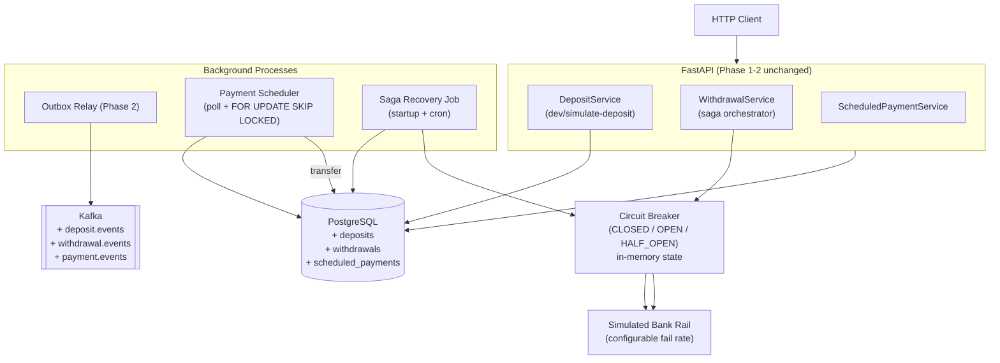

# System Design — Phase 3: Advanced Payments

**Phase:** 3 of 6
**Status:** `not started`

---

## 1. Architecture Overview

Phase 3 adds bank rail simulation, withdrawal saga, circuit breaker, and scheduled payment runner.



---

## 2. New Database Tables

```sql
-- Alembic 0005_add_deposits
CREATE TABLE deposits (
    id                  UUID          PRIMARY KEY DEFAULT gen_random_uuid(),
    account_id          UUID          NOT NULL REFERENCES accounts(id),
    amount              NUMERIC(20,8) NOT NULL CHECK (amount > 0),
    currency            VARCHAR(3)    NOT NULL DEFAULT 'USD',
                        -- ISO 4217. Always stored with the amount — never implicit.
    status              VARCHAR(20)   NOT NULL DEFAULT 'pending',
                        -- pending → completed | held | rejected
                        -- Ledger entry written ONLY on 'completed'. No money exists until then.
    source_type         VARCHAR(30)   NOT NULL,
                        -- bank_transfer | card_topup | direct_debit
    external_reference  VARCHAR(255)  NOT NULL,
                        -- Reference from the payment rail (their transaction ID).
                        -- This is what the banking partner sends in their webhook.
    idempotency_key     VARCHAR(255)  UNIQUE NOT NULL,
                        -- Constructed as "deposit:{external_reference}" — prevents double-credit
                        -- even if the webhook arrives twice before the first completes.
    created_at          TIMESTAMPTZ   NOT NULL DEFAULT NOW(),
                        -- When we received the webhook
    completed_at        TIMESTAMPTZ,
                        -- When we wrote the ledger entry (NULL until status='completed')
    updated_at          TIMESTAMPTZ   NOT NULL DEFAULT NOW()
);
CREATE UNIQUE INDEX idx_deposits_external_ref ON deposits (external_reference);
-- Unique constraint is the idempotency guarantee: same external_reference never double-credits.
-- Second arrival raises UniqueViolation → catch it, return 200 with original record (not 409).


-- Alembic 0006_add_withdrawals
CREATE TABLE withdrawals (
    id                   UUID          PRIMARY KEY DEFAULT gen_random_uuid(),
    account_id           UUID          NOT NULL REFERENCES accounts(id),
    amount               NUMERIC(20,8) NOT NULL CHECK (amount > 0),
    currency             VARCHAR(3)    NOT NULL DEFAULT 'USD',
    status               VARCHAR(20)   NOT NULL DEFAULT 'pending',
                         -- pending → submitted → completed | failed
                         -- pending:   debit ledger entry written, funds reserved
                         -- submitted: rail API called, awaiting confirmation
                         -- completed: rail confirmed success
                         -- failed:    rail rejected, compensating entry written (money returned)
    failure_code         VARCHAR(50),
                         -- NULL unless status='failed'. Values:
                         -- INVALID_ACCOUNT | BENEFICIARY_CLOSED | TIMEOUT |
                         -- INSUFFICIENT_FUNDS_AT_RAIL | NETWORK_ERROR
    destination_type     VARCHAR(30)   NOT NULL,
                         -- bank_transfer | card_withdrawal
    destination_details  JSONB         NOT NULL,
                         -- { "sort_code": "...", "account_number": "..." }
                         -- or { "iban": "..." } — encrypted at rest in production
    external_reference   VARCHAR(255),
                         -- The rail's transaction ID. NULL until submitted.
                         -- Filled when the rail API returns its reference.
    idempotency_key      VARCHAR(255)  UNIQUE NOT NULL,
                         -- Client-provided. Prevents duplicate withdrawal submissions.
    created_at           TIMESTAMPTZ   NOT NULL DEFAULT NOW(),
    submitted_at         TIMESTAMPTZ,
                         -- When we called the rail API (NULL until submitted)
    completed_at         TIMESTAMPTZ,
                         -- When the rail confirmed (NULL until completed/failed)
    updated_at           TIMESTAMPTZ   NOT NULL DEFAULT NOW()
);
CREATE INDEX idx_withdrawals_stuck
    ON withdrawals (created_at)
    WHERE status IN ('pending', 'submitted');
-- Partial index for recovery job: find stuck rows without a full table scan.
-- Covers both crash-before-submit (pending) and crash-after-submit (submitted).


-- Alembic 0007_add_scheduled_payments
CREATE TABLE scheduled_payments (
    id              UUID          PRIMARY KEY DEFAULT gen_random_uuid(),
    from_account_id UUID          NOT NULL REFERENCES accounts(id),
    to_account_id   UUID          NOT NULL REFERENCES accounts(id),
    amount          NUMERIC(20,8) NOT NULL,
    frequency       VARCHAR(20)   NOT NULL,  -- daily | weekly | monthly
    next_run_at     TIMESTAMPTZ   NOT NULL,
    status          VARCHAR(20)   NOT NULL DEFAULT 'active',
                    -- active | cancelled
    created_at      TIMESTAMPTZ   NOT NULL DEFAULT NOW()
);
CREATE INDEX idx_scheduled_payments_due
    ON scheduled_payments (next_run_at)
    WHERE status = 'active';
```

---

## 3. Deposit Flow (Push Model)

Real bank rails push money to you — they don't wait for you to ask. Your banking partner
(ClearBank, Railsr, Wise Platform) receives funds into your settlement account and sends
your system a webhook. The `simulate-deposit` endpoint mimics that webhook.

### Real-world context

In production:
- The banking partner sends a webhook: "Inbound payment received: £100, reference BANK-TXN-001"
- Your system matches the payment to a user account (by virtual IBAN, reference, or account number)
- Validation runs: AML screening, limits check, account status check
- Only after validation passes does money enter the ledger

### Flow

```
POST /v1/dev/simulate-deposit
  { "account_id": "...", "amount": "100.00", "currency": "USD",
    "source_type": "bank_transfer", "external_reference": "BANK-TXN-001" }
        │
        ▼
  INSERT deposits (status='pending', external_reference, ...) — raises on duplicate
        │
        ▼ Validation (AML, limits, account status)
        │
    ┌───┴───────────────────┐
    ▼ pass                   ▼ fail
  Inside ONE DB transaction:   UPDATE deposits SET status='rejected'
  INSERT ledger_entry            INSERT outbox (deposit.rejected)
    (debit=system_account,       (NO ledger entry — money never existed)
     credit=user_account,
     entry_type='deposit',
     reference_id=deposit.id,
     idempotency_key='deposit:{deposit_id}')
  UPDATE deposits SET status='completed', completed_at=NOW()
  INSERT outbox row (deposit.completed)
```

### Reference chain

```
deposits.id  ←──  ledger_entries.reference_id  (entry_type = 'deposit')
```

The ledger entry is written ONLY when `status = 'completed'`. If the deposit is pending,
held, or rejected, **no money has moved** — the ledger stays untouched. This is the
fundamental rule: money only exists in the ledger.

**Idempotency:** The `UNIQUE INDEX` on `external_reference` makes double-credit impossible.
The second arrival of the same `external_reference` raises a `UniqueViolation` — catch it,
return 200 with the original deposit record (not 409). This matches how real banking webhooks
work: partners retry on timeout, and your system must handle duplicates gracefully.

---

## 4. Withdrawal Saga (Orchestration)

Orchestration means one function owns the entire flow. The saga state is auditable in the
`withdrawals.status` column — readable at 2am without reconstructing event sequences.

### Why debit first? (The critical insight)

Between "user clicks withdraw" and "rail confirms" (could be 2 seconds or 3 business days
depending on the payment scheme), the user could initiate transfers, other withdrawals, or
receive scheduled payments. If you don't debit immediately, their available balance is a lie —
they can overdraw.

**Every neobank debits on submission, compensates on failure.** The user sees "pending" in
their UI, their balance reflects the debit, and if the rail bounces it, money comes back via
a compensating entry. This is not a design choice — it's the only correct approach.

### Flow

```
POST /v1/withdrawals
  { "amount": "50.00", "currency": "USD",
    "destination_type": "bank_transfer",
    "destination_details": { "sort_code": "12-34-56", "account_number": "12345678" } }
        │
        ▼ TX 1: debit sender (inside one DB transaction)
  INSERT withdrawals (status='pending')
  SELECT account FOR UPDATE
  check balance >= amount
  INSERT ledger_entry (debit=user_account, credit=system_account,
                       entry_type='withdrawal', reference_id=withdrawal.id,
                       idempotency_key='withdrawal:{withdrawal_id}')
  INSERT outbox (withdrawal.initiated)
  COMMIT
        │ (user's balance is now reduced — funds reserved)
        │
        ▼ TX 2: call bank rail (outside any DB transaction)
  UPDATE withdrawals SET status='submitted', submitted_at=NOW()
  circuit_breaker.call(rail.send_withdrawal, withdrawal_id, amount, destination_details)
        │
    ┌───┴───────────────────────────────────┐
    ▼ success                                ▼ failure
  TX 3a: complete                          TX 3b: compensate
  UPDATE status='completed',               INSERT ledger_entry (debit=system_account,
         completed_at=NOW()                       credit=user_account,
  INSERT outbox(withdrawal.completed)              entry_type='withdrawal_compensation',
                                                   reference_id=withdrawal.id,
                                                   idempotency_key='compensation:{withdrawal_id}')
                                           UPDATE status='failed',
                                                  failure_code='...',
                                                  completed_at=NOW()
                                           INSERT outbox(withdrawal.failed)
```

### Reference chain

```
withdrawals.id  ←──  ledger_entries.reference_id  (entry_type = 'withdrawal')
                      Written at TX 1. Money leaves user immediately.

withdrawals.id  ←──  ledger_entries.reference_id  (entry_type = 'withdrawal_compensation')
                      Written ONLY on failure (TX 3b). Money returns to user.
```

### Crash scenarios

| Crash point | State on restart | Recovery action |
|---|---|---|
| After TX 1, before rail call | `status = 'pending'`, ledger debited | Recovery retries rail or compensates |
| After rail call, before TX 3 | `status = 'submitted'`, no confirmation | Recovery queries rail status or compensates after timeout |
| After TX 3 | Terminal state (`completed` or `failed`) | No action needed |

---

## 5. Saga Recovery Job

The gap between TX 1 (debit) and TX 3 (complete/compensate) is where crashes cause limbo.
The recovery job closes that gap. In production, this is how every neobank handles the
"what if we crash while talking to the rail" problem.

```python
# workers/saga_recovery.py
async def recover_stuck_withdrawals(db, circuit_breaker, rail):
    cutoff = datetime.utcnow() - timedelta(minutes=5)

    # Find withdrawals stuck in non-terminal states
    stuck = await db.execute(
        select(Withdrawal)
        .where(Withdrawal.status.in_(["pending", "submitted"]))
        .where(Withdrawal.updated_at < cutoff)
        .with_for_update(skip_locked=True)  # safe if two recovery jobs run
    )
    for w in stuck.scalars():
        if w.status == "pending":
            # Crashed before calling rail — retry or compensate
            try:
                result = await circuit_breaker.call(rail.send_withdrawal, w.id, w.amount, w.destination_details)
                if result.success:
                    await complete_withdrawal(db, w, result.external_reference)
                else:
                    await compensate_withdrawal(db, w, failure_code=result.failure_code)
            except CircuitOpenError:
                await compensate_withdrawal(db, w, failure_code="CIRCUIT_OPEN")

        elif w.status == "submitted":
            # Crashed after calling rail — query rail for status
            try:
                status = await rail.query_status(w.external_reference)
                if status == "completed":
                    await complete_withdrawal(db, w, w.external_reference)
                elif status == "failed":
                    await compensate_withdrawal(db, w, failure_code=status.reason)
                # else: still processing at rail — leave it, check again next cycle
            except Exception:
                # Can't reach rail — if stuck too long (>30min), compensate
                if w.updated_at < datetime.utcnow() - timedelta(minutes=30):
                    await compensate_withdrawal(db, w, failure_code="TIMEOUT")
```

The recovery job runs:
1. On application startup (catches crashes from the last downtime)
2. Every 5 minutes via the scheduler

**Key principle:** The recovery job must be idempotent. The `idempotency_key` on the
compensation ledger entry (`compensation:{withdrawal_id}`) ensures that running recovery
twice on the same withdrawal doesn't double-credit.

---

## 6. Circuit Breaker

Custom 50-line implementation — no library needed. State lives in-memory (Redis in production
for multi-instance coordination; in-memory is fine for this single-process learning project).

```python
# app/circuit_breaker.py
class CircuitBreaker:
    """
    States:
      CLOSED     — normal operation, calls pass through
      OPEN       — rail is down, calls fail fast with CircuitOpenError
      HALF_OPEN  — cooldown elapsed, one probe call allowed through
    """
    def __init__(self, failure_threshold=3, cooldown_seconds=30):
        self.state = "CLOSED"
        self.failure_count = 0
        self.last_failure_at = None
        self.failure_threshold = failure_threshold
        self.cooldown_seconds = cooldown_seconds

    async def call(self, fn, *args, **kwargs):
        if self.state == "OPEN":
            elapsed = (datetime.utcnow() - self.last_failure_at).seconds
            if elapsed >= self.cooldown_seconds:
                self.state = "HALF_OPEN"
            else:
                raise CircuitOpenError("Bank rail unavailable")

        try:
            result = await fn(*args, **kwargs)
            if self.state == "HALF_OPEN":
                self._reset()          # probe succeeded → close circuit
            return result
        except RailError as e:
            self._record_failure()
            raise

    def _record_failure(self):
        self.failure_count += 1
        self.last_failure_at = datetime.utcnow()
        if self.failure_count >= self.failure_threshold:
            self.state = "OPEN"

    def _reset(self):
        self.state = "CLOSED"
        self.failure_count = 0
        self.last_failure_at = None

    def status(self) -> dict:
        return {"state": self.state, "failure_count": self.failure_count}
```

**State transitions:**

```
CLOSED ──(3 consecutive failures)──▶ OPEN
OPEN   ──(30s cooldown elapsed)────▶ HALF_OPEN
HALF_OPEN ──(probe succeeds)───────▶ CLOSED
HALF_OPEN ──(probe fails)──────────▶ OPEN
```

Circuit state is exposed in `GET /v1/health`:
```json
{ "circuit_breaker": { "state": "OPEN", "failure_count": 3 } }
```

---

## 7. Scheduled Payments

The scheduler is a simple polling loop — no APScheduler dependency. `FOR UPDATE SKIP LOCKED`
prevents two scheduler instances from executing the same payment concurrently.

```python
# workers/payment_scheduler.py
async def scheduler_loop(db, transfer_service):
    while True:
        async with db.begin():
            due = await db.execute(
                select(ScheduledPayment)
                .where(ScheduledPayment.status == "active")
                .where(ScheduledPayment.next_run_at <= datetime.utcnow())
                .with_for_update(skip_locked=True)
                .limit(50)
            )
            for payment in due:
                try:
                    idempotency_key = f"scheduled:{payment.id}:{payment.next_run_at.isoformat()}"
                    await transfer_service.transfer(
                        from_account_id=payment.from_account_id,
                        to_account_id=payment.to_account_id,
                        amount=payment.amount,
                        idempotency_key=idempotency_key,
                    )
                    payment.next_run_at = advance_schedule(payment.next_run_at, payment.frequency)
                except InsufficientBalanceError:
                    payment.next_run_at = advance_schedule(payment.next_run_at, payment.frequency)
                    # INSERT outbox row: payment.skipped event
        await asyncio.sleep(10)
```

**Idempotency key construction:** `scheduled:{payment_id}:{next_run_at}` — unique per
scheduled slot. If the scheduler crashes after executing the transfer but before advancing
`next_run_at`, the same slot is retried but the idempotency key prevents double-execution.

---

## 8. New API Endpoints

| Method | Path | Auth | Description |
|--------|------|------|-------------|
| `POST` | `/v1/dev/simulate-deposit` | dev-only | Simulate inbound bank webhook |
| `GET` | `/v1/deposits/{id}` | JWT | Deposit status |
| `POST` | `/v1/withdrawals` | JWT | Initiate withdrawal with saga |
| `GET` | `/v1/withdrawals/{id}` | JWT | Withdrawal status + saga_status |
| `POST` | `/v1/scheduled-payments` | JWT | Create recurring payment |
| `GET` | `/v1/scheduled-payments` | JWT | List user's scheduled payments |
| `DELETE` | `/v1/scheduled-payments/{id}` | JWT | Cancel a scheduled payment |

---

## 9. New Events

| Topic | Event Type | Trigger |
|-------|-----------|---------|
| `deposit.events` | `deposit.completed` | Deposit validated and credited to user |
| `deposit.events` | `deposit.rejected` | Deposit failed validation (no money moved) |
| `deposit.events` | `deposit.held` | Deposit flagged for manual review |
| `withdrawal.events` | `withdrawal.initiated` | Withdrawal debited (status=pending, money reserved) |
| `withdrawal.events` | `withdrawal.completed` | Rail confirmed, status=completed |
| `withdrawal.events` | `withdrawal.failed` | Rail rejected, compensating entry written, money returned |
| `payment.events` | `payment.executed` | Scheduled payment transferred successfully |
| `payment.events` | `payment.skipped` | Scheduled payment skipped (insufficient balance) |

All events use the same envelope from Phase 2:
```json
{ "event_id": "uuid", "event_type": "...", "occurred_at": "ISO8601", "version": "1", "payload": {} }
```

### Ledger entry types added in Phase 3

| `entry_type` | `reference_id` points to | When written |
|---|---|---|
| `deposit` | `deposits.id` | When deposit status → completed |
| `withdrawal` | `withdrawals.id` | Immediately on submission (debit upfront) |
| `withdrawal_compensation` | `withdrawals.id` | Only when rail fails (reversal) |
| `scheduled` | `transfers.id` | When scheduled payment executes |

---

## 10. Codebase Structure (Phase 3 additions)

New files only. Phase 1–2 structure unchanged.

```
minibank/
├── alembic/versions/
│   ├── 0005_add_deposits.py
│   ├── 0006_add_withdrawals.py
│   └── 0007_add_scheduled_payments.py
├── app/
│   ├── models/
│   │   ├── deposit.py              # Deposit ORM model
│   │   ├── withdrawal.py           # Withdrawal ORM model (saga_status column)
│   │   └── scheduled_payment.py   # ScheduledPayment ORM model
│   ├── schemas/
│   │   ├── deposit.py              # SimulateDepositRequest, DepositResponse
│   │   ├── withdrawal.py           # WithdrawalRequest, WithdrawalResponse (saga_status)
│   │   └── scheduled_payment.py   # ScheduledPaymentRequest/Response
│   ├── routers/
│   │   ├── deposits.py             # GET /v1/deposits/{id}
│   │   ├── withdrawals.py          # POST /v1/withdrawals, GET /v1/withdrawals/{id}
│   │   ├── scheduled_payments.py  # POST/GET/DELETE /v1/scheduled-payments
│   │   └── dev.py                  # + POST /v1/dev/simulate-deposit
│   ├── services/
│   │   ├── deposit_service.py      # Deposit flow: insert + ledger + outbox in one TX
│   │   └── withdrawal_service.py  # Saga orchestrator: debit → rail → complete/compensate
│   └── circuit_breaker.py         # CircuitBreaker class (50 lines, no external dependency)
├── workers/
│   ├── payment_scheduler.py        # Poll scheduled_payments + FOR UPDATE SKIP LOCKED
│   └── saga_recovery.py            # Find saga_status='debited' stuck >5min → compensate
├── rail/
│   └── simulator.py                # Simulated bank rail (configurable fail rate via env var)
└── tests/
    ├── test_deposits.py            # Idempotency: same external_ref → one credit
    ├── test_withdrawals.py         # Saga happy path + compensation path
    ├── test_saga_recovery.py       # Simulate crash mid-saga → recovery compensates
    ├── test_circuit_breaker.py     # 3 failures → OPEN, probe, CLOSED
    └── test_scheduled_payments.py  # Correct time, two schedulers → one execution
```

---

## 11. Key Design Decisions

| Decision | Choice | Rationale |
|----------|--------|-----------|
| Withdrawal timing | Debit immediately on submission, compensate on failure | Between submit and rail confirmation (seconds to days), user could overdraw. Every neobank does this — it's the only correct approach. |
| Compensation mechanism | Separate ledger entry (`withdrawal_compensation`) | Not a ledger UPDATE (append-only). The compensating entry creates an auditable paper trail — auditors can see both the debit and the reversal. |
| Saga style | Orchestration (one function, explicit `status` column) | Choreography via events is harder to audit and debug mid-saga; orchestration is how banks actually do it. Status column is readable at 2am. |
| Deposit model | Push (webhook simulation) | Banks receive webhooks from partners; users don't initiate deposits. Teaching the real model from day one. |
| Deposit ledger timing | Write ledger ONLY on `completed` status | Money does not exist until it's in the ledger. Pending/held/rejected deposits have zero financial impact. |
| Deposit idempotency | DB unique constraint on `external_reference` | Stronger than Redis (survives restart); prevents double-credit even if webhook arrives twice before first completes. Return 200 (not 409) on duplicate — match real webhook retry behavior. |
| Currency column | Stored on every deposit/withdrawal row | Every amount must carry its currency. Implicit currency is a compliance violation and an FX bug waiting to happen. |
| Destination details | JSONB column | Different rails need different fields (sort code vs IBAN vs routing number). JSONB avoids wide sparse columns. Encrypted at rest in production. |
| Failure codes | Explicit enum-like values on withdrawal | Ops needs to know WHY a rail rejected. "failed" alone is useless at 2am. |
| Circuit breaker state | In-memory | Redis adds complexity; in-memory is correct for single process; document the production upgrade path (Redis for multi-instance) |
| Scheduler | Polling loop + FOR UPDATE SKIP LOCKED | No APScheduler dependency; locking logic is explicit and teachable |
| Scheduled payment idempotency | `scheduled:{id}:{next_run_at}` key | Prevents double-execution if scheduler crashes after transfer but before advancing `next_run_at` |
