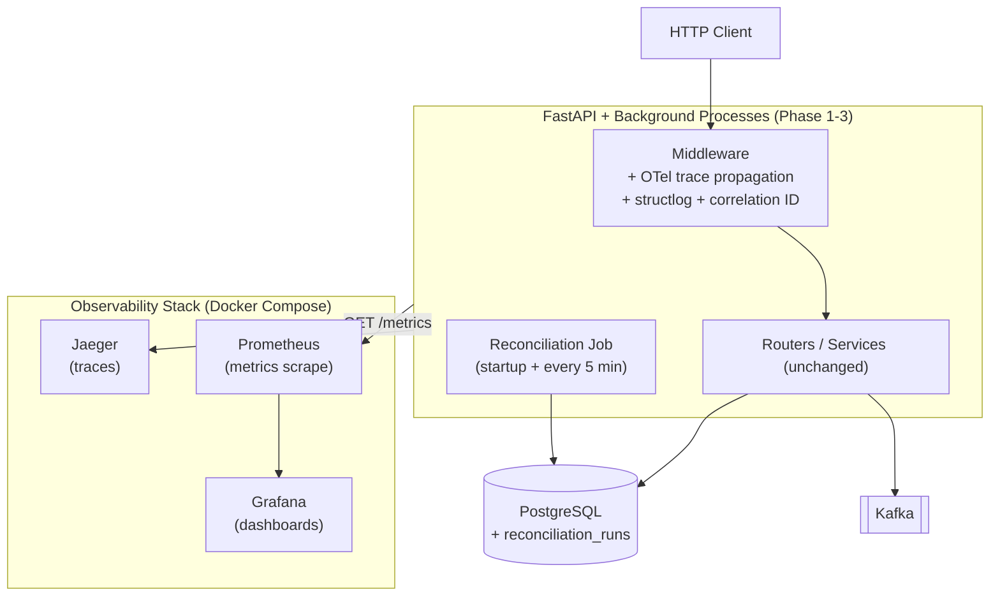

# System Design — Phase 4: Observability & Reconciliation

**Phase:** 4 of 6
**Status:** `not started`

---

## 1. Architecture Overview

No new business services. Phase 4 cross-cuts the existing system with observability instrumentation and adds a reconciliation job.



---

## 2. New Database Table

```sql
-- Alembic 0008_add_reconciliation_runs
CREATE TABLE reconciliation_runs (
    id            UUID          PRIMARY KEY DEFAULT gen_random_uuid(),
    ran_at        TIMESTAMPTZ   NOT NULL DEFAULT NOW(),
    status        VARCHAR(20)   NOT NULL,   -- clean | discrepancy
    total_credits NUMERIC(20,8) NOT NULL,
    total_debits  NUMERIC(20,8) NOT NULL,
    difference    NUMERIC(20,8) NOT NULL,   -- should be 0.00000000 when clean
    details       JSONB
);
```

---

## 3. Structured Logging (structlog)

Replace plain `logging` with `structlog`. Every log line is JSON:

```json
{
  "timestamp": "2024-01-15T10:30:00.123Z",
  "level": "info",
  "request_id": "550e8400-e29b-41d4-a716-446655440000",
  "user_id": "a1b2c3...",
  "service": "minibank-api",
  "event": "transfer_completed",
  "transfer_id": "...",
  "amount": "100.00",
  "duration_ms": 45
}
```

**Correlation ID middleware:** Generate a UUID per request, bind it to the structlog context,
propagate it in Kafka message headers so consumers log with the same ID.

```python
# app/middleware/correlation_id.py (already exists from Phase 1 — extend it)
async def correlation_id_middleware(request, call_next):
    request_id = request.headers.get("X-Request-Id") or str(uuid4())
    structlog.contextvars.bind_contextvars(request_id=request_id)
    response = await call_next(request)
    response.headers["X-Request-Id"] = request_id
    return response
```

---

## 4. Distributed Tracing (OpenTelemetry → Jaeger)

**Auto-instrumented:** FastAPI, SQLAlchemy async, `confluent-kafka` producer.

**Manual spans** (add these explicitly — they're the interesting ones):
- `balance_check` — how long does summing ledger entries take?
- `idempotency_lookup` — Redis GET latency
- `circuit_breaker.call` — includes the rail call duration

**Trace propagation:**
- HTTP: `traceparent` header (W3C Trace Context standard)
- Kafka: trace context in message headers — consumer extracts and creates a child span

```python
# app/config.py additions
from opentelemetry import trace
from opentelemetry.sdk.trace import TracerProvider
from opentelemetry.exporter.otlp.proto.http.trace_exporter import OTLPSpanExporter

def setup_tracing(service_name: str):
    provider = TracerProvider()
    provider.add_span_processor(
        BatchSpanProcessor(OTLPSpanExporter(endpoint="http://jaeger:4318/v1/traces"))
    )
    trace.set_tracer_provider(provider)
```

---

## 5. Metrics (Prometheus)

Use `prometheus-fastapi-instrumentator` for automatic HTTP metrics. Add custom business metrics manually.

| Metric | Type | Labels |
|--------|------|--------|
| `http_requests_total` | Counter | method, path, status_code |
| `http_request_duration_seconds` | Histogram | method, path |
| `transfers_total` | Counter | status (completed / failed / compensated) |
| `withdrawals_saga_total` | Counter | outcome (completed / compensated) |
| `kafka_messages_published_total` | Counter | topic |
| `kafka_consumer_lag` | Gauge | topic, consumer_group |
| `circuit_breaker_state` | Gauge | state (0=closed, 1=half_open, 2=open) |
| `reconciliation_discrepancy` | Gauge | – (0 = clean, non-zero = alert) |

Expose at `GET /metrics` (not under `/v1/`) for Prometheus to scrape.

---

## 6. Health Check

**GET /v1/health** — no auth required.

```json
{
  "data": {
    "status": "healthy",
    "checks": {
      "database": "ok",
      "kafka": "ok",
      "redis": "ok"
    },
    "circuit_breaker": {
      "state": "CLOSED",
      "failure_count": 0
    },
    "last_reconciliation": {
      "ran_at": "2024-01-15T10:25:00Z",
      "status": "clean",
      "difference": "0.00000000"
    }
  }
}
```

Returns `503` with the same shape if any connectivity check fails. The circuit breaker state
comes directly from the `CircuitBreaker` instance (Phase 3).

---

## 7. Reconciliation Logic

```python
# workers/reconciliation.py
async def run_reconciliation(db) -> ReconciliationRun:
    result = await db.execute(
        """
        SELECT
            SUM(amount) FILTER (WHERE entry_side = 'credit') AS total_credits,
            SUM(amount) FILTER (WHERE entry_side = 'debit')  AS total_debits
        FROM ledger_entries
        """
    )
    total_credits, total_debits = result.one()
    difference = total_credits - total_debits

    status = "clean" if difference == Decimal("0") else "discrepancy"
    run = ReconciliationRun(
        status=status,
        total_credits=total_credits,
        total_debits=total_debits,
        difference=difference,
    )
    db.add(run)

    if status == "discrepancy":
        logger.error("reconciliation_discrepancy", difference=str(difference))
        reconciliation_discrepancy_gauge.set(float(difference))
    else:
        reconciliation_discrepancy_gauge.set(0)

    return run
```

The invariant: every debit has a matching credit. If `total_credits != total_debits`, money
was created or destroyed — that's a bug.

---

## 8. Grafana Dashboards

**Dashboard 1: API Health**
- Request rate (req/s)
- p50 / p95 / p99 latency
- Error rate (5xx / 4xx)
- Transfer success vs failure vs compensation rate

**Dashboard 2: Event Pipeline**
- Outbox relay throughput (messages/s)
- Kafka consumer lag per topic/group
- DLQ message count
- Reconciliation discrepancy gauge

---

## 9. Codebase Structure (Phase 4 additions)

New files only. Phase 1–3 structure unchanged.

```
minibank/
├── alembic/versions/
│   └── 0008_add_reconciliation_runs.py
├── docker-compose.yml              # + jaeger, prometheus, grafana services
├── observability/
│   ├── prometheus.yml              # Prometheus scrape config (scrapes :8000/metrics)
│   └── grafana/
│       ├── datasources.yml         # Auto-provision Prometheus datasource
│       ├── api-health.json         # API health dashboard definition
│       └── event-pipeline.json    # Event pipeline dashboard definition
├── app/
│   ├── config.py                  # + setup_tracing(), setup_metrics()
│   ├── models/
│   │   └── reconciliation_run.py  # ReconciliationRun ORM model
│   ├── routers/
│   │   └── health.py              # GET /v1/health (DB + Kafka + Redis + recon)
│   └── middleware/
│       └── correlation_id.py      # (extend Phase 1 version: bind structlog context)
├── workers/
│   └── reconciliation.py          # Reconciliation job (startup + every 5 min)
└── tests/
    ├── test_health.py             # Healthy response; 503 when DB down
    └── test_reconciliation.py    # Corrupt a ledger entry → discrepancy detected
```

---

## 10. Key Design Decisions

| Decision | Choice | Rationale |
|----------|--------|-----------|
| OTel exporter | OTLP/HTTP | Simpler than gRPC for local Docker; no TLS required |
| Trace sampling | Always-on | Dev environment; note production cost would require probabilistic |
| Kafka trace propagation | Message headers | W3C standard; consumers can extract and create child spans |
| Reconciliation invariant | `SUM(credits) == SUM(debits)` | Double-entry property; detects any bug that creates or destroys money |
| Recon schedule | Every 5 minutes | Shows scheduled job pattern clearly; short enough to catch issues quickly |
| structlog vs standard logging | structlog | Bound context variables propagate automatically; no format strings |
