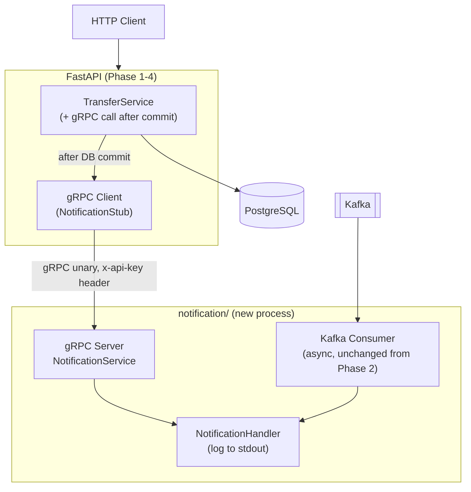

# System Design — Phase 5: gRPC & Service Extraction

**Phase:** 5 of 6
**Status:** `not started`

---

## 1. Architecture Overview

The notification Kafka consumer is joined by a standalone gRPC service. Both coexist intentionally — to experience the difference between async Kafka and sync gRPC for the same problem.



**Two notification paths on the same transfer:**
1. gRPC (synchronous, time-sensitive) — API calls notification service before returning response
2. Kafka consumer (async, bulk) — outbox relay publishes event, consumer processes it eventually

Both log to stdout. The point is to feel the difference: gRPC adds latency to the API response; Kafka doesn't.

---

## 2. Proto Definition

```protobuf
// notification/proto/minibank/notification/v1/notification.proto
syntax = "proto3";
package minibank.notification.v1;

// Use the standard gRPC Health Checking Protocol for health checks.
// Import: grpc.health.v1.Health

service NotificationService {
  rpc SendNotification(SendNotificationRequest)
      returns (SendNotificationResponse);
}

message SendNotificationRequest {
  string user_id       = 1;
  string event_type    = 2;  // transfer.completed, payment.executed, etc.
  string reference_id  = 3;  // transfer_id, payment_id, etc.
  string message       = 4;
}

message SendNotificationResponse {
  string notification_id = 1;
  bool   delivered       = 2;
}
```

**Why standard gRPC Health Checking Protocol?** Docker Compose health checks and service meshes
understand it natively. Don't define a custom `Check` RPC.

---

## 3. buf CLI Setup

```yaml
# notification/buf.yaml
version: v2
modules:
  - path: proto

# notification/buf.gen.yaml
version: v2
plugins:
  - plugin: buf.build/protocolbuffers/python
    out: generated
  - plugin: buf.build/grpc/python
    out: generated
```

Codegen: `cd notification && buf generate`

The generated stubs go to `notification/generated/`. Never hand-edit generated files.

---

## 4. gRPC Interceptors (Server-side)

```
Incoming gRPC call
    │
    ▼
1. Auth interceptor
   — check x-api-key metadata header
   — abort with UNAUTHENTICATED if missing or wrong
    │
    ▼
2. Logging interceptor
   — structlog: method, caller, duration_ms
    │
    ▼
3. Tracing interceptor
   — extract traceparent from metadata
   — create child OTel span (cross-service trace continuity)
    │
    ▼
Handler
```

```python
# notification/interceptors.py
class AuthInterceptor(grpc.aio.ServerInterceptor):
    async def intercept_service(self, continuation, handler_call_details):
        metadata = dict(handler_call_details.invocation_metadata)
        if metadata.get("x-api-key") != settings.INTERNAL_API_KEY:
            async def abort(request, context):
                await context.abort(grpc.StatusCode.UNAUTHENTICATED, "invalid api key")
            return grpc.unary_unary_rpc_method_handler(abort)
        return await continuation(handler_call_details)
```

---

## 5. API-side gRPC Client

```python
# app/grpc_client.py
import grpc
from notification.generated.minibank.notification.v1 import notification_pb2_grpc, notification_pb2

async def get_notification_stub() -> notification_pb2_grpc.NotificationServiceStub:
    channel = grpc.aio.insecure_channel(settings.NOTIFICATION_GRPC_ADDR)
    return notification_pb2_grpc.NotificationServiceStub(channel)

# In TransferService.transfer(), after DB commit:
stub = await get_notification_stub()
await stub.SendNotification(
    notification_pb2.SendNotificationRequest(
        user_id=str(transfer.receiver_id),
        event_type="transfer.completed",
        reference_id=str(transfer.id),
        message=f"You received {transfer.amount}",
    ),
    metadata=[
        ("x-api-key", settings.INTERNAL_API_KEY),
        ("traceparent", current_trace_context()),  # propagate OTel trace
    ],
    timeout=2.0,  # never block the API response for more than 2s
)
```

**Timeout:** gRPC calls are synchronous from the API's perspective. Always set a timeout.
If the notification service is down, the transfer still completed — don't fail the transfer.
Catch `grpc.aio.AioRpcError` and log a warning.

---

## 6. Docker Compose Services

| Service | Image | Port | Depends on |
|---------|-------|------|------------|
| `api` | `./Dockerfile` | 8000 | postgres, redis, kafka |
| `notification` | `./notification/Dockerfile` | 50051 | kafka |
| `postgres` | `postgres:16` | 5432 | – |
| `redis` | `redis:7` | 6379 | – |
| `kafka` | `confluentinc/cp-kafka:7.6` | 9092 | zookeeper |
| `zookeeper` | `confluentinc/cp-zookeeper:7.6` | 2181 | – |
| `jaeger` | `jaegertracing/all-in-one:1.55` | 16686 | – |
| `prometheus` | `prom/prometheus:v2.50` | 9090 | – |
| `grafana` | `grafana/grafana:10.4` | 3000 | prometheus |

Use `healthcheck` on postgres, redis, kafka so dependent services wait for readiness.

---

## 7. Codebase Structure (Phase 5 additions)

New files only. Phase 1–4 structure unchanged.

```
minibank/
├── docker-compose.yml             # + notification service, health checks on all services
├── Makefile                       # make proto, make up, make test
├── README.md                      # Architecture, design decisions, docker compose up
├── notification/                  # Standalone gRPC notification service
│   ├── Dockerfile
│   ├── buf.yaml
│   ├── buf.gen.yaml
│   ├── proto/
│   │   └── minibank/notification/v1/
│   │       └── notification.proto
│   ├── generated/                 # buf generate output — never hand-edit
│   │   └── minibank/notification/v1/
│   │       ├── notification_pb2.py
│   │       └── notification_pb2_grpc.py
│   ├── server.py                  # gRPC server entry point
│   ├── interceptors.py            # AuthInterceptor, LoggingInterceptor, TracingInterceptor
│   ├── handler.py                 # NotificationServiceServicer implementation
│   └── consumer.py                # Kafka consumer (moved from workers/notification_consumer.py)
├── app/
│   └── grpc_client.py             # NotificationStub factory + timeout/error handling
└── tests/
    └── test_grpc_notification.py  # Auth interceptor rejects bad key; happy path sends notification
```

---

## 8. Key Design Decisions

| Decision | Choice | Rationale |
|----------|--------|-----------|
| Both gRPC and Kafka | Keep both | Experiencing the difference is the learning goal — gRPC adds API latency, Kafka doesn't |
| TLS | Plaintext | Docker internal network; production upgrade path is documented in README |
| Service auth | `x-api-key` metadata header | Simplest; same pattern as Phase 6 API key auth |
| buf CLI | Yes | Modern standard for proto management; enforces lint and breaking change detection |
| gRPC timeout | 2 seconds | Notification service failure must not fail the transfer |
| Health check | Standard gRPC Health Checking Protocol | Docker, k8s, and load balancers understand it natively |
