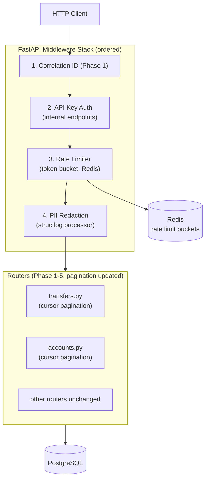

# System Design — Phase 6: API Hardening

**Phase:** 6 of 6
**Status:** `not started`

---

## 1. Architecture Overview

No new services. Phase 6 adds middleware layers and replaces offset pagination. All changes are cross-cutting — business logic is untouched.



---

## 2. Rate Limiting (Redis Token Bucket)

Token bucket algorithm: each user has a bucket of N tokens. Each request consumes one token. Tokens refill at a fixed rate. If the bucket is empty, the request is rejected.

**Implementation using Redis atomic Lua script** — check and decrement in a single round-trip,
preventing race conditions between concurrent requests:

```lua
-- rate_limit.lua (loaded once, called per request)
local key = KEYS[1]           -- e.g., "ratelimit:user:abc123"
local limit = tonumber(ARGV[1])
local window = tonumber(ARGV[2])  -- seconds
local now = tonumber(ARGV[3])

local count = redis.call("INCR", key)
if count == 1 then
    redis.call("EXPIRE", key, window)
end
if count > limit then
    return {0, redis.call("TTL", key)}  -- {allowed=0, retry_after}
end
return {1, 0}  -- {allowed=1, retry_after=0}
```

```python
# app/middleware/rate_limit.py
class RateLimitMiddleware(BaseHTTPMiddleware):
    LIMITS = {
        "default": (60, 60),      # 60 requests per 60 seconds
        "/v1/transfers": (10, 60), # 10 per 60 seconds
        "/v1/dev/simulate-deposit": (20, 60),
    }

    async def dispatch(self, request: Request, call_next):
        user_id = get_user_id_from_token(request)  # None if unauthenticated
        key_subject = f"user:{user_id}" if user_id else f"ip:{request.client.host}"

        path = request.url.path
        limit, window = self.LIMITS.get(path, self.LIMITS["default"])
        bucket_key = f"ratelimit:{path}:{key_subject}"

        allowed, retry_after = await redis.eval(LUA_SCRIPT, 1, bucket_key, limit, window, time.time())

        if not allowed:
            return JSONResponse(
                status_code=429,
                headers={"Retry-After": str(retry_after)},
                content={"error": {"code": "RATE_LIMITED", "message": "Too many requests"}},
            )

        response = await call_next(request)
        # Add rate limit headers to every response
        response.headers["X-RateLimit-Limit"] = str(limit)
        return response
```

---

## 3. Cursor-Based Pagination

Offset pagination (`LIMIT 20 OFFSET 40`) breaks when rows are inserted mid-page: a new
transfer inserted at position 35 pushes everything down by one, causing row 40 to appear
twice (once on page 2, once on page 3) — or never.

Cursor pagination uses `(created_at, id)` as a stable position marker:

```python
# app/pagination.py
from base64 import b64encode, b64decode
import json
from datetime import datetime
from uuid import UUID

def encode_cursor(created_at: datetime, id: UUID) -> str:
    payload = {"created_at": created_at.isoformat(), "id": str(id)}
    return b64encode(json.dumps(payload).encode()).decode()

def decode_cursor(cursor: str) -> tuple[datetime, UUID]:
    payload = json.loads(b64decode(cursor.encode()).decode())
    return datetime.fromisoformat(payload["created_at"]), UUID(payload["id"])
```

**Query pattern:**
```python
# GET /v1/accounts/me/transactions?cursor=<token>&limit=20
query = (
    select(LedgerEntry)
    .where(LedgerEntry.account_id == account_id)
    .order_by(LedgerEntry.created_at.desc(), LedgerEntry.id.desc())
    .limit(limit + 1)  # fetch one extra to know if there's a next page
)
if cursor:
    cursor_created_at, cursor_id = decode_cursor(cursor)
    query = query.where(
        or_(
            LedgerEntry.created_at < cursor_created_at,
            and_(
                LedgerEntry.created_at == cursor_created_at,
                LedgerEntry.id < cursor_id,
            ),
        )
    )

rows = await db.execute(query)
entries = rows.scalars().all()

next_cursor = None
if len(entries) > limit:
    entries = entries[:limit]
    last = entries[-1]
    next_cursor = encode_cursor(last.created_at, last.id)
```

**Response shape:**
```json
{
  "data": [...],
  "meta": {
    "limit": 20,
    "next_cursor": "eyJjcmVhdGVkX2F0IjogIjIwMjQtMDEtMT...",
    "has_more": true
  }
}
```

Applied to: `GET /v1/accounts/me/transactions` and `GET /v1/accounts/me/activity`.

---

## 4. API Key Auth for Internal Endpoints

Internal endpoints don't need user identity — they need operator/service identity.
A static `INTERNAL_API_KEY` env var is the simplest correct solution.

```python
# app/middleware/api_key_auth.py
INTERNAL_PATHS = {"/v1/dev/simulate-deposit", "/v1/health", "/metrics"}

class APIKeyMiddleware(BaseHTTPMiddleware):
    async def dispatch(self, request: Request, call_next):
        if request.url.path in INTERNAL_PATHS:
            api_key = request.headers.get("X-API-Key")
            if api_key != settings.INTERNAL_API_KEY:
                return JSONResponse(
                    status_code=401,
                    content={"error": {"code": "UNAUTHORIZED", "message": "Invalid API key"}},
                )
        return await call_next(request)
```

`INTERNAL_API_KEY` is set in `.env`. Never commit a real value — `.env.example` shows the key name.

---

## 5. PII Redaction (structlog Processor)

A structlog processor runs on every log event before it's serialized. It strips sensitive fields:

```python
# app/logging.py
SENSITIVE_KEYS = {"password", "hashed_password", "access_token", "refresh_token", "authorization"}

def redact_pii(logger, method, event_dict):
    for key in list(event_dict.keys()):
        if key.lower() in SENSITIVE_KEYS:
            event_dict[key] = "[REDACTED]"
    # Also redact nested dicts (e.g., request body logged as dict)
    for key, value in event_dict.items():
        if isinstance(value, dict):
            for nested_key in list(value.keys()):
                if nested_key.lower() in SENSITIVE_KEYS:
                    value[nested_key] = "[REDACTED]"
    return event_dict

# Configure structlog with this processor in app/config.py:
structlog.configure(
    processors=[
        redact_pii,
        structlog.processors.JSONRenderer(),
    ]
)
```

---

## 6. No New Database Tables

Phase 6 is pure middleware and query changes. No migrations needed.

---

## 7. Codebase Structure (Phase 6 additions)

```
minibank/
├── app/
│   ├── middleware/
│   │   ├── correlation_id.py      # (Phase 1 — unchanged)
│   │   ├── api_key_auth.py        # NEW: API key check for internal paths
│   │   └── rate_limit.py          # NEW: Token bucket, Redis Lua script, headers
│   ├── pagination.py              # NEW: encode_cursor / decode_cursor utilities
│   ├── logging.py                 # NEW: structlog config + redact_pii processor
│   ├── routers/
│   │   └── accounts.py           # UPDATE: replace offset pagination with cursor in
│   │                              #   GET /v1/accounts/me/transactions
│   │                              #   GET /v1/accounts/me/activity
│   └── config.py                  # + INTERNAL_API_KEY, RATE_LIMIT_* settings
└── tests/
    ├── test_rate_limiting.py      # 61 req/min → 429; headers present
    ├── test_throttling.py         # 11 transfers/min → 429 before general limit
    ├── test_cursor_pagination.py  # Insert mid-page → no duplicates or gaps
    ├── test_api_key_auth.py       # Missing key → 401; correct key → 200
    └── test_pii_redaction.py      # Login request → password not in logs
```

---

## 8. Key Design Decisions

| Decision | Choice | Rationale |
|----------|--------|-----------|
| Rate limit algorithm | Token bucket (Redis Lua) | Atomic check-and-decrement prevents races; Lua script runs on Redis server |
| Rate limit key | `path:user_id` (auth) or `path:ip` (unauth) | Per-user fairness; IP fallback for unauthenticated callers |
| Cursor encoding | Base64 JSON `(created_at, id)` | Opaque to clients; composite key handles ties within same millisecond |
| Cursor stability | `(created_at DESC, id DESC)` ordering | UUID v4 is random but still gives a stable secondary sort |
| API key storage | Env var | Simplest; no rotation needed for a learning project; document DB table upgrade path |
| PII redaction scope | structlog processor | Runs on all log events; centralized, not scattered across services |
